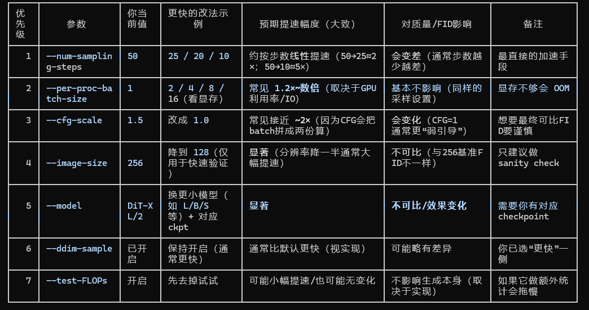
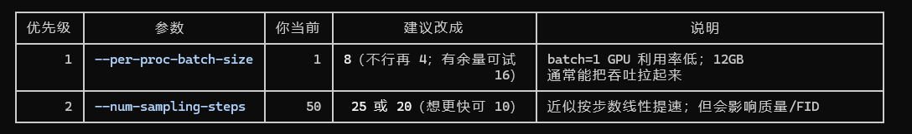
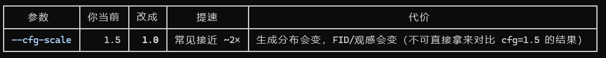
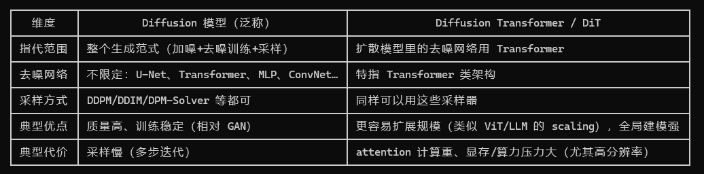

#### 不是很明白，Taylorseer做了什么，能够加速？

● Recalled 1 memory, searched for 5 patterns, read 4 files (ctrl+o to expand)

● 可以把 TaylorSeer 的加速理解成一句话：

  它不是每个 diffusion step 都老老实实把每一层 Attention / MLP
  全算一遍，而是“隔几步完整算一次，其他步用泰勒展开近似补出来”。

  ---
  它具体做了什么

  1. 先决定这一步是“全量计算”还是“泰勒近似”

  在 models.py 里，每次前向前都会先调用 cal_type(...)：
  models.py:324

  这个函数在这里：
  cache_functions/cal_type.py:0

  它的逻辑大致是：

  - 某些关键 step：current['type'] = 'full'
  - 其他 step：current['type'] = 'Taylor'

  也就是说，不是每个采样步都做完整 Transformer block 计算。

  ---
  2. 在 full 步，正常算 Attention 和 MLP，并把结果缓存下来

  看这里：
  models.py:129-155

  当 current['type'] == 'full' 时：

  - 正常跑 attention：self.attn(...)
  - 正常跑 mlp：self.mlp(...)
  - 然后调用 derivative_approximation(...) 把当前结果和历史结果整理成泰勒展开需要的“导数近似项”

  对应代码：
  - models.py:143-154
  - taylor_utils/__init__.py:4-22

  这里缓存的不是单纯“上一步结果”，而是：
  - 0阶项：当前 feature
  - 1阶/更高阶项：由相邻 full step 的差分近似得到

  所以它是在为后面的近似计算做准备。

  ---
  3. 在 Taylor 步，不再跑 Attention / MLP，直接用泰勒公式近似输出

  看这里：
  models.py:164-178

  当 current['type'] == 'Taylor' 时，它没有调用
  - self.attn(...)
  - self.mlp(...)

  而是直接：

  - taylor_formula(cache_dic, current) 近似 attention 输出
  - taylor_formula(cache_dic, current) 近似 mlp 输出

  对应公式实现：
  taylor_utils/__init__.py:24-37

  本质上是在做：

  [
  f(t) \approx f(t_0) + f'(t_0)(t-t_0) + \frac{1}{2}f''(t_0)(t-t_0)^2 + ...
  ]

  也就是说：

  假设相邻 diffusion steps 之间，某一层的输出变化比较平滑，那么中间几步可以不用重新跑大算子，直接根据前面几次 full
  结果外推出来。

  ---
  为什么这能加速

  因为 DiT 里最贵的部分，本来就是每层的：

  - Attention
  - MLP

  尤其 attention 很贵。
  从 cache_functions/attention.py:64-72 也能看出作者在专门统计 FLOPs。

  而 Taylor 步里，这两块都被跳过了，只做：

  - 条件调制的一些轻量操作
  - 从 cache 里取值
  - 用泰勒公式做张量组合

  所以加速来源就是：

  核心：少做大矩阵运算

  把原来每一步都要做的昂贵计算：

  - QKV 投影
  - Attention 矩阵乘
  - MLP 两层线性层

  变成：

  - 只有一部分 step 做完整计算
  - 其他 step 用缓存 + 多项式近似替代

  ---
  直觉类比

  可以把它想成视频插帧 / 轨迹预测：

  - full step = 真正渲染关键帧
  - Taylor step = 根据前后趋势推一个中间帧

  如果网络输出随 diffusion step 变化得比较平滑，这种近似误差就不会太大，但能省掉很多算力。

  ---
  它加速的前提假设

  TaylorSeer 隐含了一个重要假设：

  同一层在相邻 diffusion timesteps 的输出变化是连续、平滑、可局部展开的。

  如果这个假设成立，那么：
  - 不必每步都重新算
  - 只需定期“刷新”一次真实值

  这也是 cache_functions/cal_type.py:7-17 里 interval 存在的原因：
  每隔若干步强制 full 一次，防止近似误差越积越大。

  ---
  一句话总结

  TaylorSeer 的加速，本质上是“跨 diffusion steps 复用网络层输出”，用泰勒展开去近似中间 step 的 Attention/MLP
  结果，从而减少完整 Transformer 计算次数。

  ---
  如果你想更具体一点

  你可以直接盯这几处代码：

  1. 决定 full 还是 Taylor
    - cache_functions/cal_type.py:0-17
  2. full 步：真算 + 缓存/估导数
    - models.py:129-155
  3. Taylor 步：直接近似，不跑大模块
    - models.py:164-178
  4. 泰勒近似公式本体
    - taylor_utils/__init__.py:24-37

#### ❯ 它和普通 cache / kv cache 的区别是什么？

● 核心区别一句话：

  普通 cache / KV cache 是“把以前算过的结果直接复用”；TaylorSeer 是“把以前算过的结果拿来做函数外推，近似未来 step
  的结果”。

  ---
  先说普通 cache / KV cache 是什么

  1. KV cache

  这是 LLM 里最常见的。

  它缓存的是 attention 里的 K/V 张量，这样在生成下一个 token 时：

  - 旧 token 的 K/V 不用重算
  - 只算新 token 的 Q，再和历史 K/V 做 attention

  所以它的前提是：

  历史上下文没变，只是序列变长。

  它本质上是 精确复用，不是近似。

  ---
  2. 普通 cache

  更广义地说，普通 cache 通常是：

  - 某个模块输入没变，输出直接复用
  - 或者某些中间特征重复出现，直接拿之前结果

  前提通常也是：

  当前要算的东西和上次相同，或者足够相同到可以直接复用。

  所以普通 cache 的关键词是：

  - 命中
  - 复用
  - 相同/不变
  - 通常追求 无误差或很小工程误差

  ---
  TaylorSeer 不一样在哪里

  TaylorSeer 不是在问：

  “这个结果我以前算过吗？”

  而是在问：

  “这个结果我虽然没算过，但能不能根据前几次结果推出来？”

  看代码最清楚：

  - models.py:129-155
  在 full 步，真的去算 attention / mlp
  - models.py:164-178
  在 Taylor 步，根本不跑 self.attn(...) 和 self.mlp(...)，直接 taylor_formula(...)

  也就是说：

  普通 cache

  - 命中了就直接拿旧结果
  - 没命中就老实重算

  TaylorSeer

  - 不要求“命中”
  - 即使当前 step 从没算过，也尝试用
  f(t0), f'(t0), f''(t0)... 去估计 f(t)

  这在 taylor_utils/__init__.py:24-37 很明显，就是标准泰勒展开。

  ---
  它和 KV cache 的本质差别

  1. 复用对象不同

  KV cache

  缓存的是：
  - attention 的 K/V
  - 面向“序列维度”的复用

  TaylorSeer

  缓存的是：
  - 某层模块输出的 0阶、1阶、2阶...导数近似项
  - 面向“diffusion step 维度”的复用

  从代码看：

  - taylor_utils/__init__.py:13-22
  updated_taylor_factors[0] = feature
  - 后面继续构造高阶差分项

  所以它缓存的不是简单 feature，而是 泰勒展开系数。

  ---
  2. 复用条件不同

  KV cache

  条件是：
  - 历史 token 不变
  - 历史 K/V 可以精确沿用

  TaylorSeer

  条件是：
  - 相邻 diffusion steps 的模块输出变化足够平滑
  - 可以局部近似

  也就是它依赖的是“平滑性”，不是“完全相同”。

  ---
  3. 是否近似不同

  KV cache

  通常是 精确等价 的加速。

  TaylorSeer

  是 近似加速。

  它明确允许误差，只要误差换来的速度收益值得。
  所以才需要定期 full 刷新，防止误差漂走：

  - cache_functions/cal_type.py:9-17

  这里每隔一个 interval 就会重新 full 计算。

  ---
  4. 跳过的计算不同

  KV cache 跳过什么

  跳过的是：
  - 历史 token 的 K/V 重新投影

  但当前步 attention 还是要做，只是成本下降了。

  TaylorSeer 跳过什么

  跳过的是：
  - 整个 attention 模块主计算
  - 整个 MLP 模块主计算

  看这里最关键：

  - models.py:175
  - models.py:178

  Taylor 步里直接：
  - taylor_formula(...) 代替 attention 输出
  - taylor_formula(...) 代替 mlp 输出

  所以它跳过得更“狠”。

  ---
  5. 适用场景不同

  KV cache 适合

  - 自回归生成
  - token 一个一个往后长
  - 历史上下文不变

  TaylorSeer 适合

  - diffusion / iterative refinement
  - 每一步都在对“同一个样本”逐步去噪
  - 相邻 step 之间网络输出变化有连续性

  它利用的是 时间步上的冗余，不是序列上的冗余。

  ---
  用一个简单比喻

  KV cache

  像你已经算过：
  - 第 1 页到第 100 页的索引

  现在新增第 101 页，只补第 101 页，不重做前 100 页。

  这是 直接沿用旧工作。

  TaylorSeer

  像你知道：
  - 某个物体最近几帧的位置、速度、加速度

  那下一帧的位置不一定非得重新完整测量，先按运动学公式估一下。

  这是 根据趋势预测新结果。

  ---
  代码层面再对一下

  TaylorSeer 的关键点

  1. 决定什么时候 full / Taylor
    - cache_functions/cal_type.py:0-17
  2. full 步记录展开系数
    - taylor_utils/__init__.py:4-22
  3. Taylor 步直接代替模块输出
    - models.py:164-178

  如果是普通 cache / KV cache，你通常会看到

  - if cached: return cached
  - 或者 attention 里保留 past_key_values
  - 当前仍然运行 attention，只是历史部分不重算

  而这里不是 return cached_output，而是：
  - 根据 cached factors 计算一个新 output

  这就是本质区别。

  ---
  最后压缩成一句最准确的话

  KV cache 是“缓存历史中间量，精确复用已算结果”；TaylorSeer 是“缓存模块输出及其变化趋势，在新的 diffusion step
  上做近似预测”。

  #### 为什么在 diffusion 里这种近似通常成立？

● 因为在 diffusion 采样里，相邻 timestep 的状态通常变化很小，网络要做的修正也会比较平滑。
  所以 TaylorSeer 才能假设：

  某一层在 step (t) 的输出，和在 step (t-1)、(t-2) 的输出之间，不是乱跳的，而是可以用局部多项式近似。

  ---
  先说最直觉的原因

  扩散采样本身就是一个逐步去噪过程。

  每一步都在做类似的事：

  - 输入 latent 只改一点点
  - 噪声水平只降一点点
  - 条件信息没变
  - 网络结构也没变

  所以从 step 到 step：

  - hidden state 不会突然完全换一个语义
  - 每层 attention / mlp 的输出，通常也是连续变化的

  这就是为什么“用上几步的趋势去估下一步”常常能 work。

  ---
  更具体一点，平滑性来自哪几部分

  1. 相邻 timestep 本来就很接近

  在 diffusion 里，step 是离散的，但本质上近似一条连续去噪轨迹。

  也就是说：

  - 第 50 步到第 49 步，不是从猫突然变成飞机
  - latent 只是沿着一条连续轨迹移动了一小段

  所以模型学到的函数更像：

  [
  \epsilon_\theta(x_t, t)
  ]

  这里对 (x_t) 和 (t) 的变化通常都是相对平滑的。

  ---
  2. 网络处理的是“同一个样本”的连续演化

  和自回归 LLM 不一样，diffusion 不是每步都新增一个 token。
  它一直在处理同一个 latent，只是噪声水平不同。

  所以相邻步之间：

  - token 数不变
  - 大体空间结构不变
  - 条件 embedding 不变
  - 只是 feature 被逐渐修正

  这意味着同一层看到的输入分布在相邻步之间通常很接近。

  ---
  3. 去噪后期尤其平滑

  通常越到后面，变化越“细修”。

  直觉上：

  - 前期：图像很乱，模型修正幅度可能大
  - 中后期：大结构已经出来了，更多是在补细节、调纹理

  这时层输出随 timestep 的变化通常更平稳，
  所以 Taylor 近似更容易成立。

  这也是很多加速方法都会：
  - 在某些关键步认真算
  - 在其余步做近似/跳算

  ---
  4. Transformer block 的输出对小扰动 often 是局部平滑的

  虽然 attention 很复杂，但它并不是一个随机跳变函数。
  在局部区域内，如果输入变化小：

  - LayerNorm 输出变化小
  - attention 权重变化通常也有限
  - MLP 输出也会连续变化

  所以从工程上讲，block 输出对 step 的映射常常是局部可展开的。

  TaylorSeer 实际上就是利用这个局部光滑性。

  ---
  为什么不是“永远成立”

  因为它只是局部近似，不是严格真理。

  下面这些情况会让近似变差：

  1. 早期高噪声阶段变化更剧烈

  前几步 latent 很乱，模型每一步可能都在做比较大的修正。
  这时候一阶/二阶近似就更容易失真。

  2. 某些层/某些 token 的响应可能不平滑

  比如注意力突然从一个区域转到另一个区域，
  那局部变化就可能不是简单多项式。

  3. 采样器步长太大

  如果 timestep 间隔本身很大，
  那“相邻步”也未必足够近，Taylor 展开误差会更大。

  ---
  所以 TaylorSeer 才要“定期 full refresh”

  它没有假设整个采样过程都能一直精确展开，
  它只假设：

  在短时间范围内可以近似。

  所以它的策略不是“永远不算”，而是：

  - 隔几步做一次 full
  - 中间几步做 Taylor

  这样做的目的就是：

  - 用 full 重新校正真实轨迹
  - 防止近似误差累计

  这在代码里就是 interval 控制的：
  cache_functions/cal_type.py:7-17

  ---
  从数学上怎么理解

  TaylorSeer依赖的是这个想法：

  把某层输出看成关于 diffusion step 的函数：

  [
  h_l(t)
  ]

  如果 (h_l(t)) 在局部足够光滑，那么在某个 anchor step (t_0) 附近：

  [
  h_l(t) \approx h_l(t_0) + h_l'(t_0)(t-t_0) + \frac{1}{2} h_l''(t_0)(t-t_0)^2 + \dots
  ]

  而 diffusion 恰好满足一个很关键的条件：

  - 采样是逐步推进的
  - 相邻 (t) 很近
  - 同一样本沿一条连续轨迹变化

  所以这个局部展开通常比在别的任务里更有希望成立。

  ---
  和 LLM 场景对比一下会更清楚

  在 LLM 里，新增一个 token 可能让注意力模式明显变化：

  - 句子语义转折
  - 新实体出现
  - 长距离依赖突然激活

  所以“按 step 对层输出做 Taylor 展开”未必自然。

  但 diffusion 不一样：

  - 没有新 token 加入
  - 没有上下文突然改变
  - 同一 latent 在连续去噪

  因此“step-to-feature”更像连续动力系统，
  天然更适合做局部近似。

  ---
  最后一句话总结

  因为 diffusion 采样本质上是在同一个 latent 上做连续、小步长、逐步去噪，导致相邻 timestep
  的网络中间特征通常变化平滑；TaylorSeer 正是利用这种局部平滑性，用少量 full 计算加上泰勒外推近似中间步骤。

  如果你愿意，我下一条可以继续讲一个最关键的问题：

  TaylorSeer 近似的到底是“最终噪声预测 (\epsilon)” ，还是“每一层 attention / mlp 的中间输出”？

  这个一搞清楚，整套方法就彻底通了。

  #### ❯ 那 TaylorSeer 近似的到底是什么？

● 近似的不是最终的 (\epsilon) / noise prediction 本身，
  而是：

  DiT 每一层 block 里面的 attention 输出 和 mlp 输出。

  ---
  直接看代码结论

  在 models.py 里：

  full 步

  models.py:143-154

  这里真的算了：

  - attn_output = self.attn(...)
  - mlp_output = self.mlp(...)

  然后把这两个输出交给：

  - derivative_approximation(cache_dic, current, attn_output)
  - derivative_approximation(cache_dic, current, mlp_output)

  说明缓存和泰勒展开的对象，就是这些模块输出 feature。

  ---
  Taylor 步

  models.py:174-178

  这里没有再算 attention / mlp，而是直接：

  - taylor_formula(cache_dic, current) 代替 attn_output
  - taylor_formula(cache_dic, current) 代替 mlp_output

  然后加回残差：

  - x = x + gate_msa.unsqueeze(1) * ...
  - x = x + gate_mlp.unsqueeze(1) * ...

  这说明它近似的是：

  每个 block 中 residual branch 的输出

  更具体说就是：

  - attention 分支输出
  - mlp 分支输出

  ---
  不是近似什么

  不是直接近似最终 model_out

  它没有在最后一层说：

  - “上一步的噪声预测先缓存一下”
  - “这一步直接用泰勒公式近似整个网络输出”

  如果是那样，你会在 DiT.forward(...) 最后或 final_layer 附近看到 Taylor 展开。
  但实际没有。

  ---
  也不是近似输入 latent x_t

  latent 还是照常一步步传下去的。
  它近似的是每层内部要加到残差上的更新量。

  ---
  更准确地说，它近似的是哪个函数？

  可以把某一层某个模块的输出看成：

  [
  f_{l,m}(t)
  ]

  其中：

  - (l) = 第几层
  - (m) = attn 或 mlp
  - (t) = diffusion step

  TaylorSeer 做的是：

  [
  f_{l,m}(t) \approx f_{l,m}(t_0) + f'_{l,m}(t_0)(t-t_0) + \cdots
  ]

  然后把这个近似输出再放回 block 里：

  [
  x \leftarrow x + \text{gate} \cdot \hat f_{l,m}(t)
  ]

  所以它近似的是：

  “某层某分支在当前 diffusion step 应该产生的 feature update”

  ---
  为什么要在层级别近似，而不是直接近似最终输出？

  因为层级别近似通常更稳。

  如果直接近似最终输出

  相当于把整个深网络的综合效果一口气外推。
  这样误差很容易大，而且不好控制。

  如果逐层近似

  每层只近似自己那一小段变换：

  - attention branch 一次
  - mlp branch 一次

  这样：
  - 近似对象更局部
  - 更容易满足平滑性
  - 也更容易定期刷新

  所以这是一个比较细粒度的近似策略。

  ---
  它缓存的到底是什么形式

  看 taylor_utils/__init__.py:13-22

  在 derivative_approximation(...) 里：

  - updated_taylor_factors[0] = feature
  - 后续更高阶项由当前 feature 和之前缓存差分得到

  所以它缓存的是：

  - 0阶：当前模块输出
  - 1阶/2阶/...：模块输出随 step 变化的差分近似

  再看 taylor_utils/__init__.py:24-37

   taylor_formula(...) 用这些项重建当前步输出。

  所以缓存对象不是：
  - KV
  - hidden state 全量快照
  - final epsilon

  而是：

  每层每个分支输出的泰勒展开系数。

  ---
  你可以把它想成什么

  普通 DiT block 是：

  [
  x_{l+1} = x_l + \text{gate}_1 \cdot \text{AttnOut}_l + \text{gate}_2 \cdot \text{MLPOut}_l
  ]

  TaylorSeer 在 Taylor 步时，把：

  - AttnOut_l
  - MLPOut_l

  换成：

  - \hat{AttnOut}_l
  - \hat{MLPOut}_l

  也就是：

  [
  x_{l+1} \approx x_l + \text{gate}_1 \cdot \hat{\text{AttnOut}}_l + \text{gate}_2 \cdot \hat{\text{MLPOut}}_l
  ]

  最后整个网络的最终噪声预测当然也因此变成近似值，
  但被近似的直接对象不是最终输出，而是中间层分支输出。

  ---
  一句话总结

  TaylorSeer 直接近似的是 DiT 每一层中 attention 分支和 mlp 分支的输出 feature（也就是 residual update），而不是最终的
  noise prediction 本身。

  #### 那误差不会层层累积爆掉吗？为什么还能 work？

● 会累积，但 不一定会爆掉。
  TaylorSeer 能 work，靠的是这几个原因同时成立：

  ---
  1. 它不是一直近似，而是会定期“校正”

  这是最关键的。

  在代码里，cal_type(...) 会决定这一步是：

  - full
  - Taylor

  见：cache_functions/cal_type.py:0-17

  也就是说它的策略不是：

  从头到尾都用近似

  而是：

  隔几步就重新做一次真实计算，把轨道拉回去。

  这相当于：

  - Taylor 步：省算力
  - Full 步：纠偏、刷新 cache、重建导数近似

  所以误差不会无限自由漂移。

  ---
  2. 它近似的是“局部小步”，不是长距离外推

  Taylor 展开最怕的不是有误差，而是：

  离展开点太远。

  TaylorSeer 只在相邻少数几个 diffusion step 上近似，
  不会拿一个很早的 full step 去硬推很远的未来。

  看 taylor_formula(...)：
  taylor_utils/__init__.py:24-37

  这里的自变量其实就是：

  - 当前 step 和最近激活 step 的距离

  如果这个距离不大，局部近似通常还能 hold。
  所以它本质上是在做短程外推，不是长程瞎猜。

  ---
  3. diffusion 本身有“迭代纠错”性质

  这个很重要。

  Diffusion 采样不是一次性输出最终图像，而是：

  - 每一步做一点修正
  - 下一步再接着修正

  所以即使某一步的中间层近似有点偏差，后续步骤仍然有机会把它拉回来。

  换句话说，它不是那种：

  - 一次错误就彻底不可逆的流水线

  而更像一个连续优化/迭代修正过程。
  这种过程对小误差往往比你想象中更有容忍度。

  ---
  4. 它近似的是层内 residual update，不是整个网络全替掉

  这是为什么前一个问题很关键。

  它不是直接说：

  - “整网输出我全用上一步代替”

  而是逐层近似：

  - attention branch output
  - mlp branch output

  见：models.py:174-178

  也就是说每一层还是保留了原本的网络结构，只是某个 residual branch 的值换成近似值。

  这种方式相比“直接近似最终输出”更稳定，因为：

  - 粒度更细
  - 每次误差局部一些
  - 网络其他部分仍在正常传递

  ---
  5. 残差结构本身对小误差更稳

  DiT block 本质上是：

  [
  x \leftarrow x + \Delta
  ]

  其中 (\Delta) 是 attention 或 mlp 分支给出的更新。

  如果你近似的是这个更新量：

  [
  x \leftarrow x + \hat{\Delta}
  ]

  那么误差实际是：

  [
  x \leftarrow x + (\Delta + e)
  ]

  也就是在残差上多加了一个误差项 (e)。

  只要这个 (e) 不太大，残差网络通常比“整层替换”更能扛。
  因为它本来就是在做逐步修正，而不是一步硬映射。

  ---
  6. AdaLN gate 也会在一定程度上“缩放误差”

  在 block 里不是直接加 attention/mlp 输出，而是：

  - gate_msa.unsqueeze(1) * ...
  - gate_mlp.unsqueeze(1) * ...

  见：models.py:148,155,175,178

  这意味着即使 Taylor 近似有误差，
  这个误差也是经过 gate 缩放后才进入主干的。

  不一定总能救，但在很多情况下会让误差没那么激进。

  ---
  7. 不是所有 step 都同样难近似

  通常：
  - 某些 step 变化大，近似容易差
  - 某些 step 变化平滑，近似很准

  TaylorSeer 的设计就是承认这一点，所以会：

  - 在关键点做 full
  - 在中间平滑区间做 Taylor

  如果调度合理，近似误差会主要出现在“可容忍”的地方，而不是最敏感的位置。

  ---
  为什么“层层近似”看起来可怕，但实际还行

  你的担心完全合理，因为表面上看它像这样：

  - 第 1 层有误差
  - 第 2 层输入已经带误差
  - 第 2 层再近似一次
  - …
  - 最后全网误差可能爆炸

  这在理论上当然可能发生。
  但它没爆掉，通常因为现实里同时有这几个“刹车”：

  刹车 1：近似区间短

  不会连续漂太远。

  刹车 2：定期 full refresh

  误差积累到一定程度前就重置了。

  刹车 3：残差更新通常相对平滑

  不是每层都在做剧烈非线性跳变。

  刹车 4：diffusion 是多步迭代纠偏

  后续步骤还能修回来一部分。

  ---
  它什么时候可能不 work

  也不是永远稳。以下情况更容易炸：

  1. interval 太大

  如果很多步都不做 full，
  Taylor 展开离锚点太远，误差会迅速变大。

  2. 高阶变化太强

  如果某层输出随 timestep 不是平滑弯曲，而是突然转向，
  低阶 Taylor 近似会明显失效。

  3. 早期高噪声阶段

  这时 latent 变化更剧烈，
  相邻 step 的 feature 不一定够接近。

  4. 某些 prompt / 条件特别敏感

  复杂语义、细节强依赖的场景，误差更容易显到最终图像里。

  ---
  用一个直觉比喻

  把 diffusion 采样想成开车沿路走：

  - full step：真的看地图、定位、校准方向
  - Taylor step：根据刚才的速度和方向，先往前滑一小段

  如果你：
  - 每隔很短一段就重新看一次地图

  那误差不会太大。

  但如果你：
  - 一次校准后盲开很远

  那就容易偏到沟里。

  TaylorSeer 能 work，不是因为“近似没有误差”，
  而是因为它把误差控制在了局部、短程、可刷新的范围里。

  ---
  最后一句总结

  误差当然会累积，但 TaylorSeer 通过“短程局部近似 + 周期性 full 刷新 + residual 结构容错 + diffusion
  的迭代纠偏”把误差限制在可接受范围内，所以通常不会爆掉。

  ####  那误差不会层层累积爆掉吗？为什么还能 work？

● 会累积，但 不一定会爆掉。
  TaylorSeer 能 work，靠的是这几个原因同时成立：

  ---
  1. 它不是一直近似，而是会定期“校正”

  这是最关键的。

  在代码里，cal_type(...) 会决定这一步是：

  - full
  - Taylor

  见：cache_functions/cal_type.py:0-17

  也就是说它的策略不是：

  从头到尾都用近似

  而是：

  隔几步就重新做一次真实计算，把轨道拉回去。

  这相当于：

  - Taylor 步：省算力
  - Full 步：纠偏、刷新 cache、重建导数近似

  所以误差不会无限自由漂移。

  ---
  2. 它近似的是“局部小步”，不是长距离外推

  Taylor 展开最怕的不是有误差，而是：

  离展开点太远。

  TaylorSeer 只在相邻少数几个 diffusion step 上近似，
  不会拿一个很早的 full step 去硬推很远的未来。

  看 taylor_formula(...)：
  taylor_utils/__init__.py:24-37

  这里的自变量其实就是：

  - 当前 step 和最近激活 step 的距离

  如果这个距离不大，局部近似通常还能 hold。
  所以它本质上是在做短程外推，不是长程瞎猜。

  ---
  3. diffusion 本身有“迭代纠错”性质

  这个很重要。

  Diffusion 采样不是一次性输出最终图像，而是：

  - 每一步做一点修正
  - 下一步再接着修正

  所以即使某一步的中间层近似有点偏差，后续步骤仍然有机会把它拉回来。

  换句话说，它不是那种：

  - 一次错误就彻底不可逆的流水线

  而更像一个连续优化/迭代修正过程。
  这种过程对小误差往往比你想象中更有容忍度。

  ---
  4. 它近似的是层内 residual update，不是整个网络全替掉

  这是为什么前一个问题很关键。

  它不是直接说：

  - “整网输出我全用上一步代替”

  而是逐层近似：

  - attention branch output
  - mlp branch output

  见：models.py:174-178

  也就是说每一层还是保留了原本的网络结构，只是某个 residual branch 的值换成近似值。

  这种方式相比“直接近似最终输出”更稳定，因为：

  - 粒度更细
  - 每次误差局部一些
  - 网络其他部分仍在正常传递

  ---
  5. 残差结构本身对小误差更稳

  DiT block 本质上是：

  [
  x \leftarrow x + \Delta
  ]

  其中 (\Delta) 是 attention 或 mlp 分支给出的更新。

  如果你近似的是这个更新量：

  [
  x \leftarrow x + \hat{\Delta}
  ]

  那么误差实际是：

  [
  x \leftarrow x + (\Delta + e)
  ]

  也就是在残差上多加了一个误差项 (e)。

  只要这个 (e) 不太大，残差网络通常比“整层替换”更能扛。
  因为它本来就是在做逐步修正，而不是一步硬映射。

  ---
  6. AdaLN gate 也会在一定程度上“缩放误差”

  在 block 里不是直接加 attention/mlp 输出，而是：

  - gate_msa.unsqueeze(1) * ...
  - gate_mlp.unsqueeze(1) * ...

  见：models.py:148,155,175,178

  这意味着即使 Taylor 近似有误差，
  这个误差也是经过 gate 缩放后才进入主干的。

  不一定总能救，但在很多情况下会让误差没那么激进。

  ---
  7. 不是所有 step 都同样难近似

  通常：
  - 某些 step 变化大，近似容易差
  - 某些 step 变化平滑，近似很准

  TaylorSeer 的设计就是承认这一点，所以会：

  - 在关键点做 full
  - 在中间平滑区间做 Taylor

  如果调度合理，近似误差会主要出现在“可容忍”的地方，而不是最敏感的位置。

  ---
  为什么“层层近似”看起来可怕，但实际还行

  你的担心完全合理，因为表面上看它像这样：

  - 第 1 层有误差
  - 第 2 层输入已经带误差
  - 第 2 层再近似一次
  - …
  - 最后全网误差可能爆炸

  这在理论上当然可能发生。
  但它没爆掉，通常因为现实里同时有这几个“刹车”：

  刹车 1：近似区间短

  不会连续漂太远。

  刹车 2：定期 full refresh

  误差积累到一定程度前就重置了。

  刹车 3：残差更新通常相对平滑

  不是每层都在做剧烈非线性跳变。

  刹车 4：diffusion 是多步迭代纠偏

  后续步骤还能修回来一部分。

  ---
  它什么时候可能不 work

  也不是永远稳。以下情况更容易炸：

  1. interval 太大

  如果很多步都不做 full，
  Taylor 展开离锚点太远，误差会迅速变大。

  2. 高阶变化太强

  如果某层输出随 timestep 不是平滑弯曲，而是突然转向，
  低阶 Taylor 近似会明显失效。

  3. 早期高噪声阶段

  这时 latent 变化更剧烈，
  相邻 step 的 feature 不一定够接近。

  4. 某些 prompt / 条件特别敏感

  复杂语义、细节强依赖的场景，误差更容易显到最终图像里。

  ---
  用一个直觉比喻

  把 diffusion 采样想成开车沿路走：

  - full step：真的看地图、定位、校准方向
  - Taylor step：根据刚才的速度和方向，先往前滑一小段

  如果你：
  - 每隔很短一段就重新看一次地图

  那误差不会太大。

  但如果你：
  - 一次校准后盲开很远

  那就容易偏到沟里。

  TaylorSeer 能 work，不是因为“近似没有误差”，
  而是因为它把误差控制在了局部、短程、可刷新的范围里。

  ---
  最后一句总结

  误差当然会累积，但 TaylorSeer 通过“短程局部近似 + 周期性 full 刷新 + residual 结构容错 + diffusion
  的迭代纠偏”把误差限制在可接受范围内，所以通常不会爆掉。

  #### ❯ 也就是说，实际的采样次数是执行full这些吗？

● 不是。

  实际采样次数 = 总共循环的 timestep 次数。
  如果你设置的是 50 步，那么实际采样就是 50 次，不是只算 full 那几次。

  ---
  1. full 和 Taylor 都属于“采样的一步”

  在这段主循环里：

  - diffusion/gaussian_diffusion.py:690-709

  每个 i 都会执行一次：

  out = self.ddim_sample(...)
  yield out
  img = out["sample"]

  也就是说，不管这一轮 current['type'] 是：

  - full
  - 还是 Taylor

  这一步都会真的参与：

  x_t -> x_{t-1}

  所以它们都算 一次采样 step。

  ---
  2. 区别不在“采不采样”，而在“这一步里模型怎么计算”

  真正区别是模型前向的方式。

  你在：

  - models.py:129
  - models.py:164

  可以看到：

  if current['type'] == 'full':
      ...
  elif current['type'] == 'Taylor':
      ...

  意思是：

  full

  这一采样步里，DiT block 做完整计算。

  Taylor

  这一采样步里，DiT block 不做完整计算，而是用缓存 + Taylor 公式近似。

  所以：

  - full = 这一步采样时，模型前向是“真算”
  - Taylor = 这一步采样时，模型前向是“近似算”

  但两者都是这 50 步采样中的一步。

  ---
  3. 更准确地说

  如果你设：

  - num_sampling_steps = 50

  那么会发生：

  - diffusion 时间轴一共走 50 个 step
  - 每个 step 都会产生一个新的 img = out["sample"]
  - 只是其中一部分 step 用 full
  - 另一部分 step 用 Taylor

  所以：

  不是

  “只在 full 的时候才采样”

  而是

  “每一步都采样，只是有些步的模型输出是完整算的，有些步是近似预测的”

  ---
  4. 你可以把它理解成

  假设 50 步里类型是：

  49 full
  48 full
  47 Taylor
  46 Taylor
  45 Taylor
  44 full
  ...

  那意思不是：

  - 只有 49、48、44 ... 这些步被采样

  而是：

  - 49 这一步采样：用 full
  - 48 这一步采样：用 full
  - 47 这一步采样：用 Taylor
  - 46 这一步采样：用 Taylor
  - 45 这一步采样：用 Taylor
  - 44 这一步采样：用 full
  - ...

  也就是 50 步都走了。

  ---
  5. 为什么会容易误解

  因为 full 看起来像“真正算”，Taylor 看起来像“只是预测，不算”。

  但从程序流程上说：

  - Taylor 也不是跳过这一步
  - 它还是会进入 ddim_sample()
  - 还是会输出 out["sample"]
  - 还是会更新到下一步的 img

  所以 Taylor 是：

  这一步的模型输出采用近似方式得到

  不是：

  这一步根本不存在

  ---
  6. 一句话总结

  不是只有 full 才算采样。
  50 步采样就是确实走了 50 步；其中一部分步用 full 完整计算，一部分步用 Taylor 近似预测。

  #### ❯ 我不是很理解，class_labels = [985]，这个类别对应ImageNet中里n11939491，里面有50张图片，所以整个流程是怎样的，为什么会得出来的sample.png这一张照片？

● 让我先看一下 sample.py 的完整流程。

● Read 1 file (ctrl+o to expand)

● 这是一个很好的问题！关键在于：这不是从 ImageNet 中取图片，而是从随机噪声生成全新的图片。

  完整流程

  1. class_labels = [985] 只是一个"条件指令"

  它不是去读取 ImageNet 中 n11939491 那 50 张真实雏菊照片。它只是告诉模型："请生成一张类别 985（雏菊）的图片"。

  2. 起点是纯随机噪声

  n = len(class_labels)  # n = 1，只生成1张图
  z = torch.randn(n, 4, latent_size, latent_size)  # shape: [1, 4, 32, 32]

  起点是一个完全随机的高斯噪声张量，跟 ImageNet 里的真实图片没有任何关系。

  3. 50 步去噪，逐步"雕刻"出图片

  diffusion.ddim_sample_loop(model.forward_with_cfg, z.shape, z, ...)

  每一步中，模型接收：
  - 当前的噪声 z
  - 类别标签 y = 985

  模型预测当前噪声中"哪部分是噪声"，然后减去一点噪声。重复 50 步后，z 从纯噪声变成了一个有意义的潜空间表示。

  4. VAE 解码成真实图片

  samples = vae.decode(samples / 0.18215).sample  # [1, 3, 256, 256]

  VAE 解码器把 32x32 的潜空间表示放大还原成 256x256 的 RGB 图片。

  5. 保存为 sample.png

  save_image(samples, "sample.png", nrow=4, normalize=True, value_range=(-1, 1))

  因为只有 1 张图（n=1），所以 sample.png 就是一张雏菊图片。

  那 ImageNet 中的 50 张真实图片起什么作用？

  它们在训练阶段起作用。DiT 模型在训练时看了 ImageNet 全部 1000 个类别的所有真实图片（包括 985 类的那 50
  张雏菊），学会了"雏菊长什么样"。训练完成后，模型把这些知识压缩存储在了权重文件 DiT-XL-2-256x256.pt 里。

  推理时不需要任何真实图片，只需要：
  - 随机噪声（起点）
  - 类别编号（条件）
  - 模型权重（"记忆"）

  简单类比

  训练 = 画家学画雏菊（看了 50 张真实雏菊照片）
  推理 = 画家凭记忆画一幅新的雏菊（不需要再看照片）
  class_labels = [985] = 告诉画家"请画雏菊"
  随机噪声 = 画布上的初始随机涂鸦
  50 步去噪 = 画家一步步把涂鸦修正成雏菊

  #### ❯ 那这个sample_ddp.py是做什么呢？

● Read 1 file (ctrl+o to expand)

● sample_ddp.py 是 sample.py 的大规模批量版本，用于质量评估。核心区别：

  sample.py vs sample_ddp.py

  ┌──────┬────────────────────┬───────────────────────────────────────┐
  │      │     sample.py      │             sample_ddp.py             │
  ├──────┼────────────────────┼───────────────────────────────────────┤
  │ 目的 │ 生成几张图看看效果 │ 批量生成大量图用于评估指标            │
  ├──────┼────────────────────┼───────────────────────────────────────┤
  │ GPU  │ 单卡               │ 多卡并行 (DDP)                        │
  ├──────┼────────────────────┼───────────────────────────────────────┤
  │ 类别 │ 手动指定，如 [985] │ 随机抽取 torch.randint(0, 1000, (n,)) │
  ├──────┼────────────────────┼───────────────────────────────────────┤
  │ 数量 │ 1~几张             │ 默认 50,000 张                        │
  ├──────┼────────────────────┼───────────────────────────────────────┤
  │ 输出 │ 一张 sample.png    │ 50000 个单独的 .png + 一个 .npz 文件  │
  └──────┴────────────────────┴───────────────────────────────────────┘

  它的流程

  1. 多 GPU 分工

  dist.init_process_group("nccl")  # 初始化多卡通信
  samples_needed_this_gpu = total_samples // world_size  # 每张卡分担一部分
  比如 4 张 GPU，每张生成 12500 张图。

  2. 循环批量生成

  for _ in pbar:
      z = torch.randn(n, ...)           # 随机噪声
      y = torch.randint(0, 1000, (n,))  # 随机类别（不是固定985了）
      samples = diffusion.ddim_sample_loop(...)  # 去噪
      samples = vae.decode(...)          # 解码
      # 逐张保存为 000000.png, 000001.png, ...

  3. 打包成 .npz 用于 FID 计算

  create_npz_from_sample_folder(sample_folder_dir, 50_000)
  把 50000 张图打包成一个 numpy 文件，然后用 https://github.com/openai/guided-diffusion/tree/main/evaluations 计算 FID
  分数。

  FID 是什么？

  FID（Fréchet Inception Distance）衡量生成图片的质量和多样性：
  - 把 50000 张生成图和 ImageNet 真实图分别通过 Inception 网络提取特征
  - 比较两组特征的统计分布差异
  - FID 越低 = 生成质量越好

  简单说

  sample.py = 画家画一幅雏菊给你看看
  sample_ddp.py = 画家画 50000 幅各种类别的画，然后请评委打分（FID）

  这就是论文里对比 TaylorSeer 加速后质量是否下降时用的脚本。

  #### ❯ 那我已经生成了图片，怎么计算FID呢？

● Searched for 1 pattern (ctrl+o to expand)

● 可以，但先要区分一种情况：

  1. 你现在只有一张 sample.png 吗？

  如果只有 sample.py 生成的那一张图，不能正常计算 FID。
  因为 FID 比较的是：

  - 一大批生成图像的分布
  - 和一大批真实图像的分布

  通常需要 几千到 5 万张 生成图。1 张图没有统计意义。

  ---
  2. 正确做法：先批量生成，再算 FID

  这个项目已经给你准备好了流程，在 sample_ddp.py:8-10 里写得很明确：

  - 批量生成大量图片
  - 保存成 .npz
  - 用 ADM / guided-diffusion 的评估脚本算 FID

  ---
  3. 这个项目里的标准流程

  第一步：运行 sample_ddp.py

  它会：

  1. 批量生成很多 .png
  2. 再自动打包成一个 .npz

  关键逻辑在：

  - sample_ddp.py:150-153：逐张保存 png
  - sample_ddp.py:159：调用 create_npz_from_sample_folder(...)
  - sample_ddp.py:39-40：保存成 sample_dir.npz

  也就是说，跑完以后你会得到类似：

  samples/某个文件夹/
  samples/某个文件夹.npz

  ---
  4. 第二步：用 guided-diffusion 的评估脚本算 FID

  sample_ddp.py:10 已经写了参考仓库：

  - https://github.com/openai/guided-diffusion/tree/main/evaluations

  通常是拿：

  - 你生成的 .npz
  - ImageNet 验证集/参考统计文件

  去跑 FID 计算。

  ---
  5. 你可以这样理解

  sample.py

  用途：看看模型能不能生成图
  输出：sample.png
  不能用来认真算 FID

  sample_ddp.py

  用途：正式评测
  输出：

  - 成千上万张 .png
  - 一个 .npz

  这个才是用来算 FID 的

  ---
  6. 为什么必须很多张？

  FID 本质上比较两组图像特征的：

  - 均值
  - 协方差

  所以它不是“这张图像不像雏菊”，而是“整体生成分布 和 真实数据分布 差多远”。

  因此必须大量采样。

  ---
  7. 如果你已经有很多 png，但还没变成 npz

  那可以直接复用 sample_ddp.py:28-42 里的函数逻辑：

  create_npz_from_sample_folder(sample_dir, num=50_000)

  它会把：

  000000.png
  000001.png
  ...
  49999.png

  打包成：

  sample_dir.npz

  然后再拿这个 .npz 去算 FID。

  ---
  8. 最关键的一句话

  FID 不是对 sample.png 这单张图计算的，而是对一整个生成图像集合计算的。

  #### ❯ def create_npz_from_sample_folder(sample_dir, num=50_000):
    """
    Builds a single .npz file from a folder of .png samples.
    """
    samples = []
    for i in tqdm(range(num), desc="Building .npz file from samples"):
        sample_pil = Image.open(f"{sample_dir}/{i:06d}.png")
        sample_np = np.asarray(sample_pil).astype(np.uint8)
        samples.append(sample_np)
    samples = np.stack(samples)
    assert samples.shape == (num, samples.shape[1], samples.shape[2], 3)
    npz_path = f"{sample_dir}.npz"
    np.savez(npz_path, arr_0=samples)
    print(f"Saved .npz file to {npz_path} [shape={samples.shape}].")
    return npz_path解析

● 好，我来解析这个函数的工作流程。

  create_npz_from_sample_folder 函数解析

  这个函数的作用是：把一个文件夹里的很多 PNG 图片打包成一个 .npz 文件。

  ---
  参数

  sample_dir: str   # 图片文件夹路径，例如 "samples/某个目录"
  num: int = 50_000 # 要打包的图片数量，默认 50000 张

  ---
  逐行解析

  1. 初始化空列表

  samples = []
  用来存储所有图片的 numpy 数组。

  ---
  2. 循环读取图片

  for i in tqdm(range(num), desc="Building .npz file from samples"):
  - 循环 num 次（默认 50000）
  - tqdm 显示进度条

  ---
  3. 读取单张图片

  sample_pil = Image.open(f"{sample_dir}/{i:06d}.png")
  - 按编号读取图片，例如：
    - 000000.png
    - 000001.png
    - ...
    - 049999.png
  - {i:06d} 表示格式化为 6 位数字，不足补 0

  ---
  4. 转换为 numpy 数组

  sample_np = np.asarray(sample_pil).astype(np.uint8)
  - 把 PIL 图像转成 numpy 数组
  - 数据类型强制为 uint8（0-255）
  - 形状通常是 (H, W, 3)，例如 (256, 256, 3)

  ---
  5. 添加到列表

  samples.append(sample_np)
  把这张图的数组加入列表。

  ---
  6. 堆叠成一个大数组

  samples = np.stack(samples)
  把列表里的 50000 个数组沿第 0 维堆叠，变成：
  shape: (50000, 256, 256, 3)

  ---
  7. 断言检查形状

  assert samples.shape == (num, samples.shape[1], samples.shape[2], 3)
  确保：
  - 第 0 维 = num（图片数量）
  - 第 3 维 = 3（RGB 三通道）

  如果不符合，程序会报错。

  ---
  8. 保存为 .npz

  npz_path = f"{sample_dir}.npz"
  np.savez(npz_path, arr_0=samples)
  - 文件名是文件夹名 + .npz
  - 例如：
    - 输入：samples/Taylor-...-50000-4-4/
    - 输出：samples/Taylor-...-50000-4-4.npz
  - arr_0=samples 表示把数组存为键名 arr_0

  ---
  9. 打印确认信息

  print(f"Saved .npz file to {npz_path} [shape={samples.shape}].")
  输出类似：
  Saved .npz file to samples/xxx.npz [shape=(50000, 256, 256, 3)].

  ---
  10. 返回路径

  return npz_path
  返回生成的 .npz 文件路径。

  ---
  总结

  这个函数做的事情就是：

  1. 从文件夹读取 50000 张 PNG
  2. 每张转成 numpy 数组
  3. 堆叠成一个大数组 (50000, H, W, 3)
  4. 保存为 .npz 文件
  5. 返回文件路径

  这个 .npz 文件就是后续计算 FID 时的输入之一。

  #### ❯ ∆-DiT是DiT的意思吗？

● 不是。

  Table 3 里的 ∆-DiT（Delta-DiT）一般表示一种基于 DiT 的“差分/增量”加速方法或一个特定的改进版本，用
  ∆（delta）强调“变化量/差分”，用于和原始采样/其他加速方法做对比。

  而 DiT 本身是模型名：Diffusion Transformer。

  在你 PDF 的 Table 3（_pdf_page07.txt:7-8）里：

  - ∆-DiT (N = 2)
  - ∆-DiT (N = 3)

  这里的 N 也是它自己的超参数（通常和间隔/跳步/更新频率有关），说明它是“某个方法”，不是单纯把 DiT 写成另一种符号。

  所以更准确的读法是：

  - DiT：模型骨干
  - ∆-DiT：在 DiT 上做的某种“delta/差分式”加速策略（论文中的一个 baseline 方法名）

  如果你希望我给出“∆-DiT 到底是哪篇论文/具体做法”，我需要去 PDF 里找到它在 Related Work
  或实验设置里第一次被定义的位置（通常会有引用编号）。你要我继续把 PDF 里提到 ∆-DiT 的那段原文定位出来并解释吗？

#### ❯ ∆-DiT是DiT的意思吗？

● 不是。

  Table 3 里的 ∆-DiT（Delta-DiT）一般表示一种基于 DiT 的“差分/增量”加速方法或一个特定的改进版本，用
  ∆（delta）强调“变化量/差分”，用于和原始采样/其他加速方法做对比。

  而 DiT 本身是模型名：Diffusion Transformer。

  在你 PDF 的 Table 3（_pdf_page07.txt:7-8）里：

  - ∆-DiT (N = 2)
  - ∆-DiT (N = 3)

  这里的 N 也是它自己的超参数（通常和间隔/跳步/更新频率有关），说明它是“某个方法”，不是单纯把 DiT 写成另一种符号。

  所以更准确的读法是：

  - DiT：模型骨干
  - ∆-DiT：在 DiT 上做的某种“delta/差分式”加速策略（论文中的一个 baseline 方法名）

  如果你希望我给出“∆-DiT 到底是哪篇论文/具体做法”，我需要去 PDF 里找到它在 Related Work
  或实验设置里第一次被定义的位置（通常会有引用编号）。你要我继续把 PDF 里提到 ∆-DiT 的那段原文定位出来并解释吗？

#### ❯ 好

● Searched for 2 patterns, read 2 files (ctrl+o to expand)

● 在这篇 TaylorSeer 论文里，∆-DiT 不是 “DiT 的意思”，而是一个单独的方法名（一个 training-free 的 DiT 加速方法 baseline）。

  我已经在 PDF 里把它“第一次出现的定义位置”和“对应参考文献”定位出来了：

  1) 论文正文里怎么说 ∆-DiT？

  在 Related Work 的“Feature Caching-based Acceleration”段落里（你 PDF 第 3 页的文本 _pdf_page03.txt:60-72）：

  “Advanced techniques such as FORA [41] and ∆-DiT [6] leverage attention and MLP representation reuse ...”

  意思是：
  - FORA 和 ∆-DiT 都属于“特征缓存/复用”这一类加速方法
  - 具体做法是复用 attention 和 MLP 的表示（representation reuse）

  所以这里的 ∆-DiT = 一种加速算法，不是模型本身。

  2) ∆-DiT 对应哪篇论文？

  在参考文献中（你 PDF 第 9 页 _pdf_page09.txt:28-32）：

  - [6] Pengtao Chen, ... Tao Chen.
  “δ-dit: A training-free acceleration method tailored for diffusion transformers.”
  arXiv:2406.01125, 2024.

  注意这里用的是 δ-dit（小写 delta/δ），而 Table 3 里显示成了 ∆-DiT（大写 delta/∆）。论文里这两个符号是在指同一个方法（就是引用 [6]
  的那篇）。

  3) 那它和 DiT 的关系是什么？

  - DiT：模型骨干（Diffusion Transformer）
  - δ/∆-DiT：基于 DiT 的一种“无需训练的加速方法”（training-free acceleration method），属于你表格里与 ToCa/FORA/DuCa 同级的 baseline
  方法名

  它不是把 “DiT” 写成 “∆-DiT”，而是“在 DiT 上做了 delta/差分/复用式加速”的一个具体方案。

  在这篇 TaylorSeer 论文里，∆-DiT 不是 “DiT 的意思”，而是一个单独的方法名（一个 training-free 的 DiT 加速方法 baseline）。

  我已经在 PDF 里把它“第一次出现的定义位置”和“对应参考文献”定位出来了：

  1) 论文正文里怎么说 ∆-DiT？

  在 Related Work 的“Feature Caching-based Acceleration”段落里（你 PDF 第 3 页的文本 _pdf_page03.txt:60-72）：

  “Advanced techniques such as FORA [41] and ∆-DiT [6] leverage attention and MLP representation reuse ...”

  意思是：
  - FORA 和 ∆-DiT 都属于“特征缓存/复用”这一类加速方法
  - 具体做法是复用 attention 和 MLP 的表示（representation reuse）

  所以这里的 ∆-DiT = 一种加速算法，不是模型本身。

  2) ∆-DiT 对应哪篇论文？

  在参考文献中（你 PDF 第 9 页 _pdf_page09.txt:28-32）：

  - [6] Pengtao Chen, ... Tao Chen.
  “δ-dit: A training-free acceleration method tailored for diffusion transformers.”
  arXiv:2406.01125, 2024.

  注意这里用的是 δ-dit（小写 delta/δ），而 Table 3 里显示成了 ∆-DiT（大写 delta/∆）。论文里这两个符号是在指同一个方法（就是引用 [6]
  的那篇）。

  3) 那它和 DiT 的关系是什么？

  - DiT：模型骨干（Diffusion Transformer）
  - δ/∆-DiT：基于 DiT 的一种“无需训练的加速方法”（training-free acceleration method），属于你表格里与 ToCa/FORA/DuCa 同级的 baseline
  方法名

  它不是把 “DiT” 写成 “∆-DiT”，而是“在 DiT 上做了 delta/差分/复用式加速”的一个具体方案。

  #### ❯ DiT与DDIM的关系

● DiT 和 DDIM 是两层不同概念，关系可以用一句话概括：

  DiT 是“去噪网络/模型”（预测噪声或余差），DDIM 是“采样器/反推算法”（决定怎么用模型一步步从噪声走到图像）。

  下面把关系讲清楚。

  ---
  1) 在扩散模型里，采样要两样东西

  生成（反向扩散）时每一步都需要：

  1. 一个模型 ( \epsilon_\theta(x_t, t, y) )
  作用：给定当前的噪声状态 (x_t) 和时间步 (t)（以及条件 (y)），预测“应该去掉多少噪声/怎么往干净图像方向走”。
  DiT 就是这个模型（把 U-Net 换成 Transformer）。
  2. 一个采样公式/调度器
  作用：定义怎样从 (x_t) 计算出 (x_{t-1})，包括步数怎么选、是否随机、系数怎么设。
  DDIM 就是这种采样方法之一（相对于 DDPM，它可以做更少步、也可做确定性采样）。

  ---
  2) 用你项目里的调用链说明（最直观）

  在 sample.py（你之前看的那个）里逻辑是：

  1. 先加载 DiT 模型：
    - model = DiT_models[...]
  2. 再创建 diffusion 采样器：
    - diffusion = create_diffusion(str(args.num_sampling_steps))
  3. 然后用 DDIM 或 DDPM 采样循环：
    - diffusion.ddim_sample_loop(model.forward_with_cfg, ...)  ← DDIM 采样
    - 或 diffusion.p_sample_loop(model.forward_with_cfg, ...) ← DDPM 采样

  关键点：
  DDIM 采样 loop 每一步都会调用一次 DiT 来得到模型输出，然后按 DDIM 的公式更新 latent。

  ---
  3) 为什么会看到 “DDIM-50 steps” 这种写法？

  因为 “DDIM-50 steps” 描述的是：

  - 用 DDIM 采样器
  - 走 50 步

  但每一步内部用的是哪个网络，可以是：

  - DiT（你这里是）
  - U-Net（Stable Diffusion 是）
  - 任何能预测噪声/余差的模型

  所以更完整的说法其实是：

  “用 DiT 作为 denoiser，用 DDIM 做 50-step sampling”。

  ---
  4) 它们分别解决什么问题？

  - DiT：决定“每一步往哪里走”（模型预测）
  - DDIM：决定“怎么走、走几步、步子多大、是否带随机性”（数值积分/采样策略）

  同一个 DiT 模型可以用不同采样器：
  - DDPM（慢、随机）
  - DDIM（更快、可确定）
  - DPM-Solver 等（更快）

  同一个 DDIM 采样器也可以配不同模型（U-Net/Transformer）。

  ####  torchrun --nproc_per_node=1 sample_ddp.py \
  --model DiT-XL/2 \
  --per-proc-batch-size 1 \
  --image-size 256 \
  --cfg-scale 1.5 \
  --ddim-sample \
  --num-sampling-steps 50 \
  --interval 4 \
  --max-order 4 \
  --num-fid-samples 50000 \
  --ckpt pretrained_models/DiT-XL-2-256x256.pt \
  --vae mse \
  --test-FLOPs \
  --sample-dir ./samples_50k_50_Flops在本台电脑上，我可以修改哪个输入，使得跑得更快

● 你这条命令里，速度主要由 采样步数、采样算法、batch size、分辨率、模型大小、CFG
  决定。想更快，可以改这些输入（按“提速幅度/对质量影响”来排）：

  1) 最大提速：减少采样步数

  你现在是：
  - --num-sampling-steps 50

  改成 25、20、10 会明显更快（近似按步数线性加速）：
  - 50 → 25：大约 2 倍更快
  - 50 → 10：大约 5 倍更快
  代价：FID/视觉质量通常会变差。

  2) 仍然很有效：提高每卡 batch（每进程 batch）

  你现在是：
  - --per-proc-batch-size 1

  如果显存允许，改成 2/4/8/16 会显著提升吞吐（GPU利用率更高、IO更集中）。例如：
  - --per-proc-batch-size 8

  代价：需要更多显存；生成图片总数不变，但整体会更快。

  3) 采样方式：DDIM vs 非DDIM

  你现在开了：
  - --ddim-sample

  一般 DDIM 已经比默认 p_sample_loop
  更快/更确定一些（实现不同略有差异）。这项你已经选了“更快”的那边，所以这里通常不需要改（除非你发现你这份代码里 ddim
  反而慢，那再测试）。

  4) 降低分辨率（如果允许）

  你现在是：
  - --image-size 256

  如果任务允许（比如只是快速 sanity check），改 128 会明显更快；但 ImageNet/DiT 常规 FID 基准是
  256，所以这会让指标不可比。

  5) 减小 CFG（通常是小幅提速/甚至不提速）

  你现在：
  - --cfg-scale 1.5

  在你的 sample_ddp.py 里，只要 cfg_scale > 1.0 就会走 forward_with_cfg，并把 batch 复制一份（z = torch.cat([z, z],
  0)），等于计算量接近翻倍。
  所以如果你把它改成：
  - --cfg-scale 1.0

  会快不少（通常接近 2x），但生成质量/多样性和 FID 可能会变化。

  6) 更根本：换小模型（如果你接受）

  你用的是：
  - --model DiT-XL/2

  如果代码支持（choices=list(DiT_models.keys())），换 L/2、B/2、S/2 之类会大幅提速，但需要对应
  checkpoint；否则不能直接换。

  7) --test-FLOPs

  --test-FLOPs 这项具体做什么要看你代码里怎么用（在 model_kwargs['test_FLOPs']
  里传入）。如果它会额外统计/记录，可能会拖慢；如果只是开关不做额外事就无影响。
  如果你只是想快，通常可以先去掉它试试。

  ---
  给你两套“更快”的改法

  A. 基本不动设置，只提高吞吐（推荐先试）：
  - 把 --per-proc-batch-size 1 改到显存能承受的最大值（比如 8/16）

  B. 直接大提速（质量会变）：
  - --num-sampling-steps 20 或 10
  - 或者 --cfg-scale 1.0（提速很明显）

  ---
  如果你告诉我你的 GPU 型号和显存（例如 3060 12GB / 4090 24GB），以及你是“要最终 50k 用来算
  FID”还是“先快速调参看图”，我可以给你一个更具体、基本不 OOM 的参数组合。

✻ Worked for 31s

❯ 列成1个表格，输出到excel

● 下面把“能改哪些输入让采样更快”整理成 1 个表格。我同时给你 CSV 格式（直接复制到 Excel：数据 → 自文本/CSV
  导入，或直接粘贴也行）。

  表格（Excel/CSV 对应）

  

  ---
  CSV（复制到 Excel 即可）

  优先级,参数,当前值,更快的改法示例,预期提速幅度（大致）,对质量/FID影响,备注
  1,--num-sampling-steps,50,"25 / 20 /
  10","约按步数线性提速（50→25≈2×；50→10≈5×）",会变差（通常步数越少越差）,最直接的加速手段
  2,--per-proc-batch-size,1,"2 / 4 / 8 /
  16（看显存）","常见1.2×~数倍（取决于GPU利用率/IO）",基本不影响（同样采样设置）,显存不够会OOM
  3,--cfg-scale,1.5,1.0,常见接近~2×（CFG会把batch拼两份算）,会变化（引导强度变弱）,最终可比FID要谨慎
  4,--image-size,256,128（仅用于快速验证）,显著（分辨率降低通常大幅提速）,不可比（与256基准不同）,建议只做sanity check
  5,--model,DiT-XL/2,换更小模型+对应ckpt,显著,不可比/效果变化,需要对应checkpoint
  6,--ddim-sample,已开启,保持开启（通常更快）,通常比默认更快（视实现）,可能略有差异,你已选更快一侧
  7,--test-FLOPs,开启,去掉试试,可能小幅提速或无变化,取决于实现（若仅统计则不影响生成）,建议实测

  如果你希望我直接生成一个 .xlsx 文件放到你的项目目录里（比如 speed_tips.xlsx），告诉我你想放在哪个路径，我可以用
  Python/pandas 写出来。

✻ Cogitated for 46s

❯ 我的电脑型号你应该知道吧

● 我不知道你电脑的具体型号。

  原因是：我在这个环境里只能看到当前 WSL/Linux 的一些信息（例如 Linux ... WSL2、当前目录、你安装的 conda
  路径等），并不会自动获得 Windows 主机的品牌/型号/GPU 型号。

  如果你希望我帮你判断 --per-proc-batch-size
  大概能开到多少、以及哪些参数最适合你的硬件，你可以用下面任意一种方式把硬件信息发我：

  方式 A：在 WSL 里查 GPU（最有用）

  nvidia-smi

  方式 B：查 CPU/内存（可选）

  lscpu
  free -h

  或者你直接告诉我：GPU 型号 + 显存大小（例如 “RTX 4060 Laptop 8GB” / “4090
  24GB”）。我就能给出更贴近你机器的加速参数建议。

❯ A

● Bash(nvidia-smi)
  ⎿  Thu Mar 12 20:13:26 2026
     +-----------------------------------------------------------------------------------------+
     | NVIDIA-SMI 580.91                 Driver Version: 581.32         CUDA Version: 13.0     |
     … +14 lines (ctrl+o to expand)

● 你的 GPU 是 NVIDIA GeForce RTX 5070，显存 12GB（12227 MiB）。

  在这张卡上，让你这条 sample_ddp.py 更快，最有效、最稳的参数改动建议是：

  推荐优先改 2 个参数（提速明显）

  

  另外一个“很快但会改指标”的开关

  
  
#### ❯ 我想知道TaylorSeer-DiT中是什么把类别映射到具体的物体的？

● Searched for 4 patterns, read 1 file (ctrl+o to expand)

● Bash(cd /mnt/d/Projects/2026-MLS4Diffusion/TaylorSeer/TaylorSeer-DiT && ls -ლა imagenet)
  ⎿  Error: Exit code 2
     ls: invalid option -- '�'
     Try 'ls --help' for more information.

● Bash(cd /mnt/d/Projects/2026-MLS4Diffusion/TaylorSeer/TaylorSeer-DiT && ls -la imagenet)
  ⎿  total 0
     drwxrwxrwx 1 don don 4096 Mar  4 22:11 .
     drwxrwxrwx 1 don don 4096 Mar 12 16:45 ..
     drwxrwxrwx 1 don don 4096 Mar  4 22:09 ILSVRC2012_img_val
  ⎿  Shell cwd was reset to /home/don

● 在 TaylorSeer-DiT（以及原版 DiT） 里，“类别 → 具体物体(如 golden retriever, tabby
  cat)”这件事不是代码里用一个字典映射出来的，而是靠 ImageNet 的类别编号（0~999）
  作为条件输入，模型在训练时学会把这个编号对应到某种语义/物体外观。

  具体到你这份代码，关键点是：

  1) 代码里“类别”是什么？

  在 sample_ddp.py:117 里：
  - y = torch.randint(0, args.num_classes, (n,), device=device)
  也就是直接采样一个 0~999 的整数标签（ImageNet-1K class index）。

  然后这个 y 被送进模型作为条件。

  2) 类别是怎么进入模型的（条件注入）？

  在 models.py:69-97 定义了 LabelEmbedder：

  - self.embedding_table = nn.Embedding(num_classes + use_cfg_embedding, hidden_size)
  这行的含义是：每个类别 id（0~999）都有一个可学习的 embedding 向量。

  在 models.py:318-322（DiT.forward）里：
  - y = self.y_embedder(y, self.training)  把类别 id → embedding 向量
  - c = t + y  把时间步 embedding t 和类别 embedding y 相加作为 conditioning
  - 后续每个 DiTBlock 用 adaLN 的方式把 c 注入到 Transformer 块里（DiTBlock 内的 adaLN_modulation）。

  所以“类别控制生成什么物体”的机制是：
  class id → embedding → 作为条件调制网络（adaLN）→ 影响生成结果。

  3) “编号对应什么物体名称”在哪里？

  这份 TaylorSeer-DiT 代码库里我没有搜到 synset/class_names/idx_to_class
  之类文件（也就是没有内置“0→金鱼、1→…”的文本表）。
  
#### ❯ 我想知道TaylorSeer-DiT中是什么把类别映射到具体的物体的？

● Searched for 4 patterns, read 1 file (ctrl+o to expand)

● Bash(cd /mnt/d/Projects/2026-MLS4Diffusion/TaylorSeer/TaylorSeer-DiT && ls -ლა imagenet)
  ⎿  Error: Exit code 2
     ls: invalid option -- '�'
     Try 'ls --help' for more information.

● Bash(cd /mnt/d/Projects/2026-MLS4Diffusion/TaylorSeer/TaylorSeer-DiT && ls -la imagenet)
  ⎿  total 0
     drwxrwxrwx 1 don don 4096 Mar  4 22:11 .
     drwxrwxrwx 1 don don 4096 Mar 12 16:45 ..
     drwxrwxrwx 1 don don 4096 Mar  4 22:09 ILSVRC2012_img_val
  ⎿  Shell cwd was reset to /home/don

● 在 TaylorSeer-DiT（以及原版 DiT） 里，“类别 → 具体物体(如 golden retriever, tabby
  cat)”这件事不是代码里用一个字典映射出来的，而是靠 ImageNet 的类别编号（0~999）
  作为条件输入，模型在训练时学会把这个编号对应到某种语义/物体外观。

  具体到你这份代码，关键点是：

  1) 代码里“类别”是什么？

  在 sample_ddp.py:117 里：
  - y = torch.randint(0, args.num_classes, (n,), device=device)
  也就是直接采样一个 0~999 的整数标签（ImageNet-1K class index）。

  然后这个 y 被送进模型作为条件。

  2) 类别是怎么进入模型的（条件注入）？

  在 models.py:69-97 定义了 LabelEmbedder：

  - self.embedding_table = nn.Embedding(num_classes + use_cfg_embedding, hidden_size)
  这行的含义是：每个类别 id（0~999）都有一个可学习的 embedding 向量。

  在 models.py:318-322（DiT.forward）里：
  - y = self.y_embedder(y, self.training)  把类别 id → embedding 向量
  - c = t + y  把时间步 embedding t 和类别 embedding y 相加作为 conditioning
  - 后续每个 DiTBlock 用 adaLN 的方式把 c 注入到 Transformer 块里（DiTBlock 内的 adaLN_modulation）。

  所以“类别控制生成什么物体”的机制是：
  class id → embedding → 作为条件调制网络（adaLN）→ 影响生成结果。

  3) “编号对应什么物体名称”在哪里？

  这份 TaylorSeer-DiT 代码库里我没有搜到 synset/class_names/idx_to_class
  之类文件（也就是没有内置“0→金鱼、1→…”的文本表）。

  也就是说：
  - 代码层面只认识 0~999 的数字标签
  - “数字标签对应的具体物体名字”来自 ImageNet 官方的 label/synset 映射表（通常在数据集/评测脚本/外部文件里）
  
❯ 把上个问题重新回答一下                                                                                                 
                                                                                                                         
● 在 TaylorSeer-DiT 里，“类别作为条件调制网络（adaLN）”的实现方式是：用 类别 embedding + 时间步 embedding 得到条件向量   
  c，再由 c 生成每个 Transformer block 的 shift/scale/gate，去动态调制 LayerNorm                                         
  输出，并控制两条分支（注意力/MLP）的余差注入强度。这对应的是 adaLN-Zero 结构。                                         
                                                                                                                         
  下面按你代码的实际执行路径解释（对应 models.py）。                                                                     
                                                                                                                         
  ---                                                                                                                    
  1) 条件向量 c 从哪里来？                                                                                               
                                                                                                                         
  在 models.py:318-322（DiT.forward）：                                                                                  
                                                                                                                         
  - t = self.t_embedder(t)：把扩散时间步 t 变成向量（时间条件）                                                          
  - y = self.y_embedder(y, self.training)：把类别 id y（0~999）查表变成向量（类别条件）                                  
  - c = t + y：融合成最终条件向量 c（shape [B, hidden_size]）                                                            
                                                                                                                         
  ---                                                                                                                    
  2) adaLN：用 c 生成 shift/scale/gate                                                                                   
                                                                                                                         
  在 models.py:116-119（DiTBlock.__init__）：                                                                            
                                                                                                                         
  self.adaLN_modulation = nn.Sequential(                                                                                 
      nn.SiLU(),                                                                                                         
      nn.Linear(hidden_size, 6 * hidden_size, bias=True)                                                                 
  )                                                                                                                      
                                                                                                                         
  在 models.py:131-132（DiTBlock.forward，full 分支）：                                                                  
                                                                                                                         
  shift_msa, scale_msa, gate_msa, shift_mlp, scale_mlp, gate_mlp = \                                                     
      self.adaLN_modulation(c).chunk(6, dim=1)                                                                           
                                                                                                                         
  也就是：每个样本的条件向量 c 会生成 6 组向量（每组长度 hidden_size）：                                                 
                                                                                                                         
  - 注意力（MSA）分支：shift_msa, scale_msa, gate_msa                                                                    
  - MLP 分支：shift_mlp, scale_mlp, gate_mlp                                                                             
                                                                                                                         
  ---                                                                                                                    
  3) shift/scale 如何调制 LayerNorm 输出（Adaptive LayerNorm）                                                           
                                                                                                                         
  在 models.py:21-22 的 modulate：                                                                                       
                                                                                                                         
  def modulate(x, shift, scale):                                                                                         
      return x * (1 + scale.unsqueeze(1)) + shift.unsqueeze(1)                                                           
                                                                                                                         
  注意 unsqueeze(1)：把 [B, C] 变成 [B, 1, C]，从而对所有 token 广播。                                                   
                                                                                                                         
  注意力分支（在注意力前调制）                                                                                           
                                                                                                                         
  在 models.py:144-145：                                                                                                 
                                                                                                                         
  attn_output = self.attn(modulate(self.norm1(x), shift_msa, scale_msa), ...)                                            
                                                                                                                         
  即：                                                                                                                   
  1. norm1(x) 做 LayerNorm                                                                                               
  2. 用 (1+scale_msa) 和 shift_msa 做按样本的仿射变换                                                                    
  3. 再送进 Attention                                                                                                    
                                                                                                                         
  MLP 分支（在 MLP 前调制）                                                                                              
                                                                                                                         
  在 models.py:151：                                                                                                     
                                                                                                                         
  mlp_output = self.mlp(modulate(self.norm2(x), shift_mlp, scale_mlp))                                                   
                                                                                                                         
  同理：LayerNorm 后再用条件生成的 shift/scale 调制。                                                                    
                                                                                                                         
  ---                                                                                                                    
  4) gate 如何控制“余差”注入强度（adaLN-Zero 的关键）                                                                    
                                                                                                                         
  注意力分支的余差（在 models.py:147-148）：                                                                             
                                                                                                                         
  x = x + gate_msa.unsqueeze(1) * attn_output                                                                            
                                                                                                                         
  MLP 分支的余差（在 models.py:154）：                                                                                   
                                                                                                                         
  x = x + gate_mlp.unsqueeze(1) * mlp_output                                                                             
                                                                                                                         
  也就是说，gate_* 决定了“把这一层分支输出加回主干”的力度；不同类别/不同时间步会得到不同 gate，从而改变信息流动方式。    
                                                                                                                         
  ---                                                                                                                    
  5) 为什么叫 adaLN-Zero？                                                                                               
                                                                                                                         
  在 models.py:267-270 初始化时，把 adaLN_modulation 最后一层线性层权重/偏置置零：                                       
                                                                                                                         
  nn.init.constant_(block.adaLN_modulation[-1].weight, 0)                                                                
  nn.init.constant_(block.adaLN_modulation[-1].bias, 0)                                                                  
                                                                                                                         
  训练初期 adaLN_modulation(c) 输出接近 0，于是：                                                                        
  - shift ≈ 0                                                                                                            
  - scale ≈ 0（等价于乘以 1，不改幅度）                                                                                  
  - gate ≈ 0（余差几乎不注入）                                                                                           
                                                                                                                         
  这样网络从“几乎不被条件扰动”的稳定状态开始，再逐渐学会如何用条件去调制每一层——训练更稳。                               
                                                                                                                         
  ---                                                                                                                    
  如果你想更进一步理解“类别如何改变生成”，可以抓住一句话：                                                               
  类别 id 不是直接映射成文字/物体名称，而是映射成一个 embedding；这个 embedding 通过 adaLN 的 shift/scale/gate           
  在每一层持续改变特征分布与余差流，最终让模型学会生成该类的结构与纹理统计。             
  
#### 继续分析代码，taylor_utils/__init__.py

● 下面我继续把 taylor_utils/__init__.py 这份代码逐行讲透（它不是恶意代码，就是普通的 PyTorch/数学实现）。

  文件：taylor_utils/__init__.py

  from typing import Dict
  import torch
  import math

  - 只用到 Dict 类型标注、PyTorch 张量、以及 math.factorial（阶乘）。

  ---
  1) derivative_approximation(cache_dic, current, feature)

  位置：taylor_utils/__init__.py:4-23

  这个函数的作用：
  在 full 步（完整算了 attention/mlp）之后，把当前模块输出 feature 写入缓存，并用有限差分构造 1 阶、2阶……的“导数近似项”（更准确说是“差分得到的导数近似”）。

  输入含义

  - feature: torch.Tensor：当前层当前模块（attn 或 mlp）真实算出来的输出（要加到主干的那条分支输出）。
  - current: Dict：当前采样步状态，至少用到：
    - current['activated_steps']：历史 full step 列表（比如 [49, 48, 44, ...] 之类）
    - current['layer']：第几层 block
    - current['module']：字符串，通常是 "attn" 或 "mlp"
    - current['step']：当前 step 下标（0..num_steps-1）
    - current['num_steps']：总采样步数
  - cache_dic: Dict：全局缓存字典，至少用到：
    - cache_dic['cache'][-1][layer][module]：最近一次“锚点(full)”的泰勒系数（字典，key=阶数 i）
    - cache_dic['max_order']：最大阶数（比如 4）
    - cache_dic['first_enhance']：前若干步强制 full 的策略参数（用于限制什么时候开始算高阶）

  核心逻辑拆解

  a) 计算差分步长 difference_distance

  taylor_utils/__init__.py:10
  difference_distance = current['activated_steps'][-1] - current['activated_steps'][-2]

  - 这里假设：activated_steps 至少有两个 full step。
  - difference_distance 表示 最近两次 full step 之间相差多少 step。
  - 它作为有限差分的分母，近似 “Δt”。

  注意：如果 activated_steps 有重复值（比如 [49,49]），这里会变成 0，后续会除以 0（这也是你记忆里提到的潜在风险来源）。

  b) 初始化 0 阶项

  taylor_utils/__init__.py:13-15
  updated_taylor_factors = {}
  updated_taylor_factors[0] = feature

  - 把当前真实 feature 作为泰勒展开的 0 阶项：( f(t_0) )

  c) 递推构造高阶项（有限差分）

  taylor_utils/__init__.py:16-21
  for i in range(cache_dic['max_order']):
      if (old_i exists) and (not too late steps):
          updated[i+1] = (updated[i] - old[i]) / difference_distance
      else:
          break

  这里的数学意义：

  - 设当前 full step 是 (t_0)，上一次 full step 是 (t_{-1})，两者间隔 (d = t_0 - t_{-1})（也就是 difference_distance）
  - 0阶：updated[0] = f(t_0)
  - 若缓存里存在上一锚点的 0阶 old[0] = f(t_{-1})，则
    - 1阶导近似：
  [
  f'(t_0) \approx \frac{f(t_0)-f(t_{-1})}{d}
  ]
  - 若缓存里还有上一锚点的 1阶 old[1]，则再做一次差分：
    - 2阶导近似（递推式的效果）：
  [
  f''(t_0) \approx \frac{f'(t_0)-f'(t_{-1})}{d}
  ]
  - 以此类推，构造到 max_order 为止。

  也就是说：它缓存的不是“解析导数”，而是“跨 full step 的差分导数近似序列”。

  d) 写回缓存

  taylor_utils/__init__.py:22
  cache_dic['cache'][-1][current['layer']][current['module']] = updated_taylor_factors

  - cache_dic['cache'][-1] 你可以理解成“最近一次锚点(full)对应的泰勒系数集合”。
  - 写回后，这一层这一模块就具备了 0..k 阶项，供后续 Taylor 步外推。

  ---
  2) taylor_formula(cache_dic, current) -> torch.Tensor

  位置：taylor_utils/__init__.py:24-37

  这个函数的作用：
  在 Taylor 步（不算 attn/mlp）时，直接用缓存的泰勒系数来“预测”当前 step 的模块输出。

  a) 计算相对位移 x

  taylor_utils/__init__.py:30
  x = current['step'] - current['activated_steps'][-1]

  - current['activated_steps'][-1] 是最近一次 full 的 step（锚点 (t_0)）
  - 当前要预测的 step 是 (t)
  - 所以 (x = t - t_0)

  通常 x 是 1、2、3 这种小整数（因为 interval 不会太大）。

  b) 套用泰勒多项式

  taylor_utils/__init__.py:34-36
  output = 0
  for i in range(len(factors)):
      output += (1/i!) * factor[i] * x^i
  return output

  对应数学公式：
  [
  \hat f(t) = \sum_{i=0}^{K} \frac{1}{i!} f^{(i)}(t_0),(t-t_0)^i
  ]

  其中：
  - factor[0] 是 (f(t_0))
  - factor[1] 是 (f'(t_0)) 的差分近似
  - factor[2] 是 (f''(t_0)) 的差分近似
  - ...

  最终输出 output 的形状与真实 feature 一样（比如 [B, N, D] 这种 token 表示）。

  ---
  3) taylor_cache_init(cache_dic, current)

  位置：taylor_utils/__init__.py:39-47

  if current['step'] == (current['num_steps'] - 1):
      cache_dic['cache'][-1][current['layer']][current['module']] = {}

  - 仅在 第一步（通常 step=num_steps-1，比如 49）时做初始化：把这一层这一模块的系数表设为空 {}。
  - 这样在第一次 full 计算后，derivative_approximation 会把 0阶=feature 写进去。
  - 如果没有这一步，后续 .get(i, None) 或直接索引可能会出现 KeyError（当然也可能在别处已经初始化，但这里是一个保险点）。

  ---
  这份实现的关键特性（总结成一句话）

  - derivative_approximation：在 full 步用“跨 full step 的有限差分递推”构造泰勒系数（0阶到若干阶）。
  - taylor_formula：在 Taylor 步用这些系数做 (x=t-t_0)
  的多项式外推，直接给出该层该模块本应输出的分支特征（余差更新量）。
  
  
#### ❯ def taylor_formula(cache_dic: Dict, current: Dict) -> torch.Tensor:
    """
    Compute Taylor expansion error.
    :param cache_dic: Cache dictionary.
    :param current: Current step information.
    """
    x = current['step'] - current['activated_steps'][-1]
    # x = current['t'] - current['activated_times'][-1]
    output = 0

    for i in range(len(cache_dic['cache'][-1][current['layer']][current['module']])):
        output += (1 / math.factorial(i)) * cache_dic['cache'][-1][current['layer']][current['module']][i] * (x ** i)

    return output详细解析，结合上下文，给出每个变量的值，相当于你来一层一层的debug

● 下面我按“真的在跑一遍时，你在这个函数内部会看到什么”的方式，把 taylor_formula() 做成一段“逐行 debug
  视角”的解析。注意：我无法在不运行代码的情况下给出你机器上真实张量的具体数值（比如某个 token
  的浮点数），但我可以把每个变量在一次典型采样步里会是什么内容/形状/来源讲清楚，并用一个具体 step/layer/module 的例子把
  x、循环次数、每一项怎么累加都算出来。

  ---
  代码回顾（你给的片段）

  def taylor_formula(cache_dic: Dict, current: Dict) -> torch.Tensor:
      x = current['step'] - current['activated_steps'][-1]
      output = 0

      for i in range(len(cache_dic['cache'][-1][current['layer']][current['module']])):
          output += (1 / math.factorial(i)) * cache_dic['cache'][-1][current['layer']][current['module']][i] * (x ** i)

      return output

  ---
  0) 先把上下文“对上号”：这函数在什么时候被调用？

  在 DiTBlock.forward 的 Taylor 步里（current['type']=="Taylor"），attention / MLP 不再真实计算，而是用：

  - taylor_formula(..., module='attn') 预测 “attn 分支输出”
  - taylor_formula(..., module='mlp') 预测 “mlp 分支输出”

  然后再像正常 residual 一样加回主干 x。

  ---
  1) 你要的“逐行 debug”：我们先固定一个具体例子

  为了能给出“每个变量的值”，我选一个非常典型且符合你项目说明的调度例子（你也在 README-CC 里反复提过类似）：

  - num_steps = 50，所以 step 序列是：49, 48, 47, ..., 0（采样循环在倒着走）
  - interval = 4
  - first_enhance = 2（前两步强制 full，所以 49 full、48 full）
  - 那么一个常见模式会是：
    - step 49: full（activated）
    - step 48: full（activated）
    - step 47: Taylor
    - step 46: Taylor
    - step 45: Taylor
    - step 44: full（activated）
    - ...

  现在我们就“debug”其中一步：

  选择当前这一次调用发生在：

  - current['step'] = 47（正在做 step=47 的模型前向）
  - 当前正在第 layer = 12 层 block（随便举一层，原理一样）
  - 当前预测的是 attention 分支：current['module'] = 'attn'
  - 最近两次 full steps 记录为：current['activated_steps'] = [49, 48]
    - 最后一个 full step 是 48（紧挨着 47 的上一轮）

  这组 current 的字段来源：
  - current['step']：在 diffusion/gaussian_diffusion.py 的采样循环里每一步都会更新
  - current['layer']：在 models.py 遍历 blocks 时逐层设置
  - current['module']：在 block 内部预测 attn/mlp 时设置
  - current['activated_steps']：由 cal_type() 在 full 步时维护追加

  ---
  2) 第 1 行：计算 x

  x = current['step'] - current['activated_steps'][-1]

  在我们这个例子里：

  - current['step'] = 47
  - current['activated_steps'][-1] = 48

  所以：
  - x = 47 - 48 = -1

  这个负号非常关键（很多人第一次会疑惑）

  因为采样 step 是从大到小走（49→48→47），所以 “当前 step” 比 “锚点 full step” 更小，导致 x 为负数。

  这意味着：TaylorSeer 在做的是围绕 full step=48 这个锚点，向“更小 step”方向外推/内插。
  后续 (x ** i) 会产生：
  - i 为偶数：(-1)^i = +1
  - i 为奇数：(-1)^i = -1

  ---
  3) 第 2 行：output 初始化

  output = 0

  - 这时 output 还是 Python 的整数 0。

  第一次进入循环时会做：
  - 0 + tensor(...)
  PyTorch 会把它提升为 tensor（这在 PyTorch 里是允许的）。所以 output 第一次累加后就变成 torch.Tensor 了。

  更“干净”的写法通常是 output = torch.zeros_like(factor0)，但这里作者用了 0，行为上一般也没问题（只是类型上先是
  int，后变 tensor）。

  ---
  4) 第 3 行：for 循环次数（len(...) 到底是多少？）

  for i in range(len(cache_dic['cache'][-1][current['layer']][current['module']])):

  我们拆开看最深那个对象是什么：

  cache_dic['cache'][-1][layer][module] 是什么？

  在你的项目里，它是一个“泰勒系数字典”，结构类似：

  cache_dic['cache'][-1][12]['attn'] = {
    0: tensor(...),  # 0阶项：f(t0)
    1: tensor(...),  # 1阶项：f'(t0) 的差分近似
    2: tensor(...),  # 2阶项：f''(t0) 的差分近似
    ...
  }

  它是在 full 步里由 derivative_approximation() 写进去的（taylor_utils/__init__.py:4-23）。

  那 len(...) 等于多少？

  - len(dict) 是 dict 里 key 的数量。
  - 假设当前已经构造了 0、1、2 三阶（共 3 个项），那么：
    - len(...) = 3
    - 循环 i = 0, 1, 2

  注意一个隐含假设：后面用的是 [i] 索引 dict：
  ... [current['module']][i]
  所以作者假设 key 一定是从 0 开始连续整数：0,1,2,...
  在 derivative_approximation() 的写法里通常确实如此；否则这里会 KeyError。

  ---
  5) 循环体：每一步到底加了什么？

  循环体是：

  output += (1 / math.factorial(i)) * factor[i] * (x ** i)

  我把它写成数学形式更直观：

  [
  \text{output} ; += ; \frac{1}{i!} \cdot f^{(i)}(t_0)\cdot x^i
  ]

  其中：
  - (t_0 = current['activated_steps'][-1])（这里是 48）
  - (x = step - t_0)（这里是 -1）
  - factor[i] = cache_dic['cache'][-1][layer][module][i]

  ---
  6) 用“标量版”把每一项的值算出来（完全像 debug）

  因为真实张量太大，我用标量演示“符号与数值怎么流动”。你把它理解为“某一个位置上的一个元素值”，张量情况下就是对每个元素都
  做同样运算。

  假设当前缓存里有 3 项（i=0..2）：

  - factor[0] = f0 = 10.0
  - factor[1] = f1 = -2.0
  - factor[2] = f2 = 0.5
  - x = -1

  那么循环过程：

  i=0

  - math.factorial(0) = 1
  - x**0 = 1
  - 增量：
    - (1/1) * 10.0 * 1 = 10.0
  - output: 0 -> 10.0

  i=1

  - math.factorial(1) = 1
  - x**1 = -1
  - 增量：
    - (1/1) * (-2.0) * (-1) = +2.0
  - output: 10.0 -> 12.0

  i=2

  - math.factorial(2) = 2
  - x**2 = 1
  - 增量：
    - (1/2) * 0.5 * 1 = 0.25
  - output: 12.0 -> 12.25

  最后返回 12.25。

  张量版时的“每个变量是什么”

  把上面的标量换成张量（以 attention 输出为例）：

  - factor[i]：torch.Tensor，形状与真实 attn 输出一致（通常是 [B, N, D] 之类）
  - (x ** i)：Python int（例如 -1、1、-8 等），会被广播成对整个 tensor 的乘法系数
  - 1 / factorial(i)：Python float
  - output：最终是一个与 factor[0] 同形状的 torch.Tensor

  ---
  7) 结合你项目的“方向性”再强调一次：为什么这里 x 是负的仍然合理？

  你这份实现里：

  - 采样 step 倒着走：49→0
  - full 锚点一般是“比当前 step 大”的那个（比如 48 是 47 的锚点）
  - 所以 x = step - t0 是负数

  只要 导数近似 那边用的 difference_distance 同样带着一致的符号（在你项目里 difference_distance = activated[-1] -
  activated[-2]，例如 48-49 = -1），那么整体方向是一致的：
  “导数（差分）是按 step 递减方向定义的”，Taylor 多项式也按同方向外推，符号就对得上。
  
#### ❯ 按 num_steps=50 interval=4 max_order=4 first_enhance=2，debug step=47 layer=0 module=attn
很想知道factor[i]：torch.Tensor是怎样的？可以理解为一个向量吗？

● 是的，一共有 28 层（28 个 DiTBlock），并且在每一层里，“module”基本是固定两种：attn 和 mlp。

  - 每个 block 都会走同一套结构：先一条 attention 分支、再一条 MLP 分支。
  - TaylorSeer 的缓存/泰勒近似也是按这两条分支分别做的，所以 current['module'] 在代码里通常就是在 "attn" 和 "mlp"
  之间切换（不会每层有不同名字）。

  少数实现里还可能有别的 module 名（比如某些变体会缓存别的子模块），但就你这个仓库的实现与 README-CC
  的描述看，主流程就是这两个。

  ---
  下面按你指定的参数，做一次“debug step=47 layer=0 module=attn”的解释，并重点回答：factor[i] 的 torch.Tensor
  到底“长什么样”，能不能理解成向量。

  你给定的 debug 场景

  - num_steps=50
  - interval=4
  - max_order=4
  - first_enhance=2
  - debug 点：step=47, layer=0, module='attn'

  在典型调度下（与你 README-CC 里举的模式一致）：
  - step 49: full（activated）
  - step 48: full（activated）
  - step 47: Taylor（正在预测）
  所以此时：
  - current['step'] = 47
  - current['activated_steps'] = [49, 48]
  - current['activated_steps'][-1] = 48
  - x = 47 - 48 = -1

  ---
  factor[i] 是什么？能理解为向量吗？

  在这一步（step=47, layer=0, attn）里：

  factor = cache_dic['cache'][-1][0]['attn']

  它是一个 dict，形如：
  {
    0: factor[0],  # 0阶项：attn_output 在 step=48 的真实值
    1: factor[1],  # 1阶项：attn_output 对 step 的“导数近似”
    2: factor[2],  # 2阶项：二阶“导数近似”
    ...
  }

  关键点 1：factor[i] 不是一个标量，也不只是“一个向量”

  factor[i] 是一个 和 attention 输出同形状的张量。
  attention 输出在 DiT block 里通常是按 token 的序列表示来算的，所以形状一般是：

  - factor[i].shape == (B, N, D)

  其中：
  - B：batch size（如果你开了 CFG，真实在模型里可能是 2×batch；但 block 看到的就是当前 forward 的 batch）
  - N：token 数（由 latent 空间的 patch 数决定）
  - D：hidden size（DiT-XL/2 的隐藏维度，具体数值要看 models.py 里的配置）

  所以它更像是：
  - 一个“矩阵/三维张量”（每个 token 一个 D 维向量），而不是单个向量。

  你当然可以“把它理解为向量”，但那是把整个张量 展平成一个超长向量（flatten）后的理解；数学上等价，但直觉上更好的理解是：

  factor[i] 是“这一层 attention 分支输出特征”的泰勒展开系数，覆盖 batch 内所有 token 的所有通道。

  关键点 2：每个 token 的每个通道都有自己的泰勒系数

  举例：对于某个 batch 样本 b、某个 token n、某个通道 d：
  - factor[0][b, n, d] 是 step=48 时 attn 输出在该位置的真实值
  - factor[1][b, n, d] 是该位置随 step 变化的一阶差分近似
  - factor[2][b, n, d] 是二阶差分近似
  - …

  也就是说泰勒近似是“逐元素”的（elementwise），只不过这些元素来自注意力输出张量。

  ---
  这一步 taylor_formula 实际怎么用这些 factor？

  因为 x=-1，Taylor 展开就是：

  [
  \hat f(47)= f(48) + f'(48)\cdot(-1) + \frac{1}{2} f''(48)\cdot(-1)^2 + \frac{1}{6} f^{(3)}(48)\cdot(-1)^3 + ...
  ]

  对应代码：

  output = 0
  for i in range(len(factor)):
      output += (1/factorial(i)) * factor[i] * ((-1)**i)

  所以如果缓存里有 0..k 阶：
  - i=0：加 + factor[0]
  - i=1：加 - factor[1]
  - i=2：加 + 0.5 * factor[2]
  - i=3：加 - (1/6) * factor[3]
  - i=4：加 + (1/24) * factor[4]

  最终 output 的 shape 仍然是 (B, N, D)，就被当作 “这一层 attention 分支在 step=47 的输出” 来用。
  
#### ❯ Taylorseer中per-proc-batch-size这个输入代表什么意思

● per-proc-batch-size 一般指 “每个进程（process）的 batch size”，也就是 每张 GPU /
  每个分布式训练进程一次前向+反向所处理的样本数（常被叫做 micro-batch size）。

  在常见的分布式启动方式（torchrun / accelerate / DDP）里，通常是 1 个进程绑定 1 张 GPU，所以它基本等价于：

  - per-proc-batch-size ≈ 每张 GPU 的 batch size

  和“总 batch size”是什么关系？

  如果你用的是数据并行（DDP），那么全局有效 batch size通常是：

  - global_batch_size = per_proc_batch_size × 进程数(=GPU数) × gradient_accumulation_steps（如果有梯度累积）

  例子：
  - 8 张 GPU，per-proc-batch-size=2，不做梯度累积
  → global batch = 2 × 8 = 16
  - 8 张 GPU，per-proc-batch-size=2，grad_accum=4
  → effective global batch = 2 × 8 × 4 = 64

  你该怎么理解/怎么调？

  - 它主要影响 显存占用：越大越吃显存，通常先调到“不 OOM 的最大值”。
  - 想在不增加显存的情况下增大全局 batch：用 梯度累积 而不是增大 per-proc-batch-size。

  如果你把 Taylorseer
  里出现这个参数的命令行（或配置文件那一段）贴出来，我可以按你项目实际用的启动器/训练框架，把“进程数到底指什么、全局
  batch 实际是多少”给你算清楚。

#### ❯ cd D:\AIs\ClaudeCode\project-1\TaylorSeer\TaylorSeer-DiT

● Bash(cd "/d/AIs/ClaudeCode/project-1/TaylorSeer/TaylorSeer-DiT" && pwd)
  ⎿  /d/AIs/ClaudeCode/project-1/TaylorSeer/TaylorSeer-DiT
  ⎿  Shell cwd was reset to C:\Users\Don

● 你现在想进入这个目录：

  D:\AIs\ClaudeCode\project-1\TaylorSeer\TaylorSeer-DiT

  我这边刚才在 shell 里临时 cd 过去并输出了 pwd，目录路径对应为：

  /d/AIs/ClaudeCode/project-1/TaylorSeer/TaylorSeer-DiT

  不过需要注意：在这个环境里每次 Bash 命令结束后工作目录会重置回
  C:\Users\Don，所以后续如果要在该目录下执行命令，我会在每条命令里都写成：

  cd "/d/AIs/ClaudeCode/project-1/TaylorSeer/TaylorSeer-DiT" && <你的命令>

  你接下来想在这个目录里做什么？（比如查 per-proc-batch-size 在哪里定义/使用）

#### ❯ 比如查 per-proc-batch-size 在哪里定义/使用

● Searched for 4 patterns, read 1 file (ctrl+o to expand)

● 在 TaylorSeer-DiT 里，--per-proc-batch-size 这个参数定义/使用的位置主要在 sample_ddp.py，它的含义就是 “每个进程（=
  每张 GPU / 每个 DDP rank）一次采样生成多少张图”。

  1) 在哪里定义？

  在 sample_ddp.py:165-175 这里用 argparse 定义的：

  - D:\AIs\ClaudeCode\project-1\TaylorSeer\TaylorSeer-DiT\sample_ddp.py:170
  parser.add_argument("--per-proc-batch-size", type=int, default=32)

  也就是命令行里可以传 --per-proc-batch-size N，不传默认 32。

  2) 在哪里使用？怎么影响程序？

  在 sample_ddp.py:99-110 这段用来计算每张 GPU 的采样批大小，以及总的 global batch：

  - sample_ddp.py:100-103
  n = args.per_proc_batch_size
  global_batch_size = n * dist.get_world_size()
  total_samples = int(math.ceil(args.num_fid_samples / global_batch_size) * global_batch_size)

  解释一下：

  - n = per-proc-batch-size：每个进程一次生成 n 个 latent（后面会 decode 成 n 张图）
  - dist.get_world_size()：总进程数（通常 = GPU 数）
  - global_batch_size = n * world_size：一次“全体 GPU 同步采样”总共生成的图片数

  后面在循环里真正用 n 来创建随机噪声、类别，并一次性生成 n 张：

  - sample_ddp.py:116-118
  z = torch.randn(n, model.in_channels, latent_size, latent_size, device=device)
  y = torch.randint(0, args.num_classes, (n,), device=device)

  并且 n 也决定了每轮要保存多少张 PNG。

  3) 举个具体例子

  假设你用 4 张 GPU（world_size=4）：
  - --per-proc-batch-size 8
  - 那么一次迭代整体会生成：8 * 4 = 32 张图（每张 GPU 各 8 张）

  如果你把 per-proc-batch-size 调大：
  - 优点：迭代次数更少，吞吐更高（通常更快）
  - 缺点：显存占用更大，可能 OOM

  如果你告诉我你是用几张 GPU 跑 sample_ddp.py（world_size=多少）以及显存大小，我可以帮你估一个比较稳的
  per-proc-batch-size 取值范围。

✻ Sautéed for 1m 46s

#### ❯ 你自己查询我的电脑

● Bash(nvidia-smi -L)
  ⎿  GPU 0: NVIDIA GeForce RTX 5070 (UUID: GPU-baa5dae0-bd9f-149e-8bde-3cb284115e3e)

● Bash(python -c "import torch, os; print('CUDA_VISIBLE_DEVICES=', os.environ.get('CUDA_VISIBLE_DEVICES'));
      print('torch', torch.__version__); print('cuda available',…)
  ⎿  Error: Exit code 1
     Traceback (most recent call last):
       File "<string>", line 1, in <module>
     ModuleNotFoundError: No module named 'torch'

● Bash(nvidia-smi --query-gpu=index,name,memory.total,driver_version --format=csv,noheader)
  ⎿  0, NVIDIA GeForce RTX 5070, 12227 MiB, 581.32

● 我已经在你电脑上查到了（通过系统命令）：

  - 你有 1 张 GPU：NVIDIA GeForce RTX 5070（GPU 0）
  - 显存总量：12227 MiB（约 12GB）
  - NVIDIA 驱动版本：581.32

  另外我也顺便测了下当前默认 python 环境：
  - python -c "import torch" 报错：没有安装 torch（或当前 python 不是你装了 torch 的那个环境）

  所以如果你问 per-proc-batch-size 在你这台机器上该怎么设：
  - 你现在这台机器的 world_size=1（单 GPU），那么 global_batch_size = per_proc_batch_size × 1，两者相等。
  - 真正能设多大主要取决于你运行脚本时用的那个环境里是否有 PyTorch、以及采样分辨率/步数等显存开销。

#### ❯ total_samples = int(math.ceil(args.num_fid_samples / global_batch_size) * global_batch_size)这个是计算什么的

● 这行是在计算 “实际要生成的总样本数（total_samples）”，并且把它 向上取整到 global_batch_size
  的整数倍，这样分布式（DDP）采样时每个进程/每张 GPU 都能分到完全一样多的工作，方便整除、不留尾巴。

  代码在 sample_ddp.py:100-109，相关变量含义是：

  - args.num_fid_samples：你希望最终用于算 FID 的图片数量（例如 50,000）
  - global_batch_size = per_proc_batch_size * world_size：一次“全体进程一起”生成的图片数量
  - total_samples：为了让采样过程 可整除，实际会生成的图片总数（可能会比 num_fid_samples 多一点点）

  公式：
  total_samples = ceil(num_fid_samples / global_batch_size) * global_batch_size

  为什么要这么算？

  因为每次迭代里，所有 GPU 一起会生成 global_batch_size 张图。如果 num_fid_samples 不是 global_batch_size
  的倍数，就会出现最后一轮不满一整轮的问题（不好分配给各个 rank，也不好保证每个进程生成张数一致）。

  举例

  假设：
  - num_fid_samples = 50000
  - per_proc_batch_size = 32
  - world_size = 8
  - global_batch_size = 32 * 8 = 256

  那么：
  - 50000 / 256 = 195.3125
  - ceil(...) = 196
  - total_samples = 196 * 256 = 50176

  也就是说程序会实际采样 50176 张（比 50000 多 176 张），后面理论上应该丢掉多出来的。

  你这份脚本有个小细节

  在这个脚本里最后调用：
  - sample_ddp.py:159
  create_npz_from_sample_folder(sample_folder_dir, args.num_fid_samples)
  它只会把前 args.num_fid_samples 张（比如前 50000 张）打包成 npz，所以“多采样的尾巴”不会进入最终用于 FID 的 npz（但 PNG
   文件夹里可能会多出一些图片）。
   
#### ❯ Diffusion模型与Diffusion Transformer的区别与联系

● 下面把“Diffusion 模型”和“Diffusion Transformer（DiT）”的区别与联系讲清楚：一句话概括是——Diffusion
  是生成过程/训练目标（框架），DiT 是在这个框架里用 Transformer 做去噪网络的一种实现。

  ---
  1) Diffusion 模型是什么（框架/方法）

  Diffusion（扩散）模型是一类生成模型范式，核心由两部分组成：

  1. 前向扩散（加噪）：把真实数据 (x_0) 逐步加噪得到 (x_t)，直到接近纯噪声。这个过程是固定的（不需要学习）。
  2. 反向扩散（去噪生成）：学习一个网络 ( \epsilon_\theta(x_t, t, \text{cond}) ) 或 (v_\theta)、(x_0\theta)
  等，用来在采样时一步步把噪声还原成数据。

  所以“Diffusion 模型”指的是：训练目标 + 采样迭代的生成方式。至于“那个网络长什么样”，框架本身不限定。

  常见的去噪网络是 U-Net（尤其在图像扩散里最常见）。

  ---
  2) Diffusion Transformer（DiT）是什么（网络架构选择）

  DiT（Diffusion Transformer）不是一种新的扩散过程，而是把扩散模型里的“去噪网络”从 U-Net 换成 Transformer（更准确说是
  Vision Transformer 风格）。

  在 DiT 里：

  - 输入 (x_t)（通常是 VAE latent 的 feature map，比如 Stable Diffusion 那种 latent 空间）
  - 把它切成 patch / token（或用卷积投影成 token）
  - 用 Transformer blocks（self-attention + MLP）处理
  - 注入时间步 (t)（以及条件如类别/文本等）
  - 输出预测的噪声/速度等（(\epsilon) 或 (v)）

  所以 DiT = Diffusion（训练/采样框架） + Transformer（去噪网络）。

  ---
  3) 核心区别：框架 vs 组件

  从“系统组成”看：
  
  

换句话说：“Diffusion”回答的是‘怎么生成’，‘DiT’回答的是‘去噪器用什么结构做’。

  ---
  4) 联系：DiT 完全依附于 Diffusion 流程

  DiT 离不开扩散框架，原因是：

  - 它的训练目标就是扩散的噪声预测/速度预测损失（例如 MSE）
  - 它的推理/生成也是按扩散采样循环跑多步（50步、250步等）

  你在项目里看到的也正是这样：
  - diffusion/gaussian_diffusion.py：负责扩散“流程”（采样循环）
  - models.py：DiT 作为去噪网络，被采样循环反复调用

  ---
  5) 实际工程里你会直观感受到的差别（尤其你这个仓库）

  在你的 TaylorSeer-DiT 项目中，“DiT 的重计算点”主要是每个 block 的：
  - self-attention
  - MLP

  这些在扩散采样过程中会被调用很多次（每个 step 一次），所以你们才会做“跳过部分 step
  的完整计算，用泰勒近似替代”的加速思路。

  这也体现了 DiT 的一个现实特点：单步比 U-Net 可能更贵，但更适合通过大规模/并行/近似等方式做体系化加速。
